**边缘计算软件**

边缘计算是在靠近终端设备或数据源头的边缘节点（位置），融合联接、计算、存储、控制和应用（功能），满足用户实时、智能、数据聚合和安全需求（价值），应用场景包括运营商、企业与IoT、工业。边缘计算的价值包括敏捷联接，海量联接与网络自动化运维管理。

边缘计算产业联盟副理事长、华为技术有限公司网络产品线副总裁刘少伟看来，边缘计算具备五大价值：

第一个价值是连接，边缘向下的衔接和向上的连接；

第二个价值是实时，尤其工业场景下低时延等实时特性是非常重要的要求；

第三个价值是数据优化，在边缘不是所有的数据都要传送到云上去，可能有大量的数据是垃圾数据，需要进行数据优化；

第四个价值是智能，在边缘可以有一些智能化的分析；

第五个价值是安全，如何在边缘构筑一道防线是非常重要的。

“边缘计算是物理世界与数字世界的桥梁，云与IoT产业的关口。”边缘计算核心是一个开放分布式平台，在网络边缘靠近数据源就近提供网络、计算、存储及应用服务，满足了行业数字化转型在联接、智能、实时、数据优化和安全的诉求。边缘计算有9大关键技术：

1.  TSN+OPC
    UA，低时延、时间确定性、统一数据模型、语义互操作、OT+ICT(OICT)一张网；

2.  边缘网络SDN network，海量接入、协议适配、复杂组网、即插即用；

3.  实时OS Real Time OS，实时调度处理、系统资源隔离保障、OT业务可靠性与确定性；

4.  容器与VM Container and VM，业务隔离、虚拟化管理与部署；

5.  边缘智能Edge Intelligence，数据分析、数据生命周期管理、AI/ML/DL、本地存活；

6.  控制器+编排器Controller
    +Orchestrator，模型驱动、自动化运维、可视化管理、应用管理、OICT业务混编；

7.  开发测试公有云Public Cloud of Development and
    Testing，设备与组网虚拟化、开发环境与工具链、仿真测试、开发者社区；

8.  边云协同Edge-Cloud Collaboration，智能协同、业务协同、数据协同、联接协同；

9.  安全Security，平台级安全、网络级安全、OS级安全、芯片级安全。

边缘计算的软件系统
==================

MEC为应用程序开发者和内容提供者，提供云计算能力和移动边缘网络的IT服务环境，从而实现超低时延、高带宽、实时性的网络信息访问。MEC所有的技术需求都是从业务实际需求出发，其核心是对外提供符合各种业务部署场景下应用，并创造价值，主要包括如下关键技术：本地分流、缓存加速、移动性管理、网络能力开放、资源管理、多接入管理、计算卸载、服务部署、协同计算等，都是基于MEC业务服务角度产生的技术需求。参考如下表，对MEC技术分为：接口相关、架构、安全、业务服务、容器化/虚拟化、应用和部署、开发工具。

| 类名          | 说明                                                                                                                                                                                                             |
|---------------|------------------------------------------------------------------------------------------------------------------------------------------------------------------------------------------------------------------|
| 接口          | 包括云计算中心与MEC服务间、MEC服务与MEC服务间、设备（终端、传感器、移动设备等）与MEC服务，MEC服务与其他服务间的交互等；交互涉及到的通信协议、通信规则、策略、标准业务数据格式化等。                              |
| 架构          | 包括MEC架构、MEC与4G、5G、NFV融合架构、以及MEC网络功能服务架构；以及MEC相关的与数据中心融合硬件架构、通用MEC硬件架构等。                                                                                         |
| 安全          | ME防篡改、安全架构，业务隐私、加密方法、防火墙等。                                                                                                                                                               |
| 业务服务      | 包括MEC服务的可靠性，可达性，服务质量，服务迁移，认证，流量计算，收费，负载均衡，关键/实时计算服务、本地分流、CDN、TCP优化、AI计算、实时数据分析、移动性支持、服务控制、业务链、接入技术、流量优化、智能采集等。 |
| 容器化/虚拟化 | 包括SDN、NFV、存储、编程模型、轻量级系统和函数库、数据旁路、微服务、数据库、MANO等。                                                                                                                             |
| 应用和部署    | 包括各类MEC应用、业务部署策略、MEC应用软件开发等，如IoT、车辆网、企业园区、工业自动化、体育馆、VR/AR、无人机、商场、医院、学校等各种场景下的业务应用。                                                           |
| 开发工具      | 标准化应用程序接口的软件开发，包括支持弹性边缘应用的软件SDK、测试维护、指标量化工具、仿真优化工具等。                                                                                                            |

Awesome
=======

<https://awesomeopensource.com/>

<https://github.com/sindresorhus/awesome>

<https://awesomeopensource.com/projects/edge>

<https://awesomeopensource.com/projects/edge-computing>

Awesome Go
----------

<https://awesome-go.com/>

<https://github.com/yinggaozhen/awesome-go-cn>

Edge Ai
-------

A curated list of resources for embedded AI

<https://github.com/crespum/edge-ai>

Awesome Mobile Machine Learning
-------------------------------

<https://www.fritz.ai>

<https://github.com/fritzlabs/Awesome-Mobile-Machine-Learning>

LF Edge
=======

2019年1月24日-Linux基金会宣布推出LF
Edge开源国际组织，旨在建立独立于硬件、芯片、云或操作系统的一个开放的、可互操作的边缘计算框架。LF
Edge由8个项目组成，它们将支持非传统视频和联网领域的需要更低延迟、更快的处理和移动性的新兴边缘应用。

<https://www.lfedge.org/projects/>

<https://github.com/lf-edge>

**Key Resources**

Web Site <https://www.lfedge.org/>

Wiki <https://www.lfedge.org>

Mail Lists <https://lists.lfedge.org>

Slack <https://slack.lfedge.org>

Technical Advisory Council (TAC):
<https://wiki.lfedge.org/pages/viewpage.action?pageId=1671298>

Outreach Committee/Marketing: <https://lists.lfedge.org/g/outreach-committee>

Landscape <https://www.stateoftheedge.com/projects/landscape/>

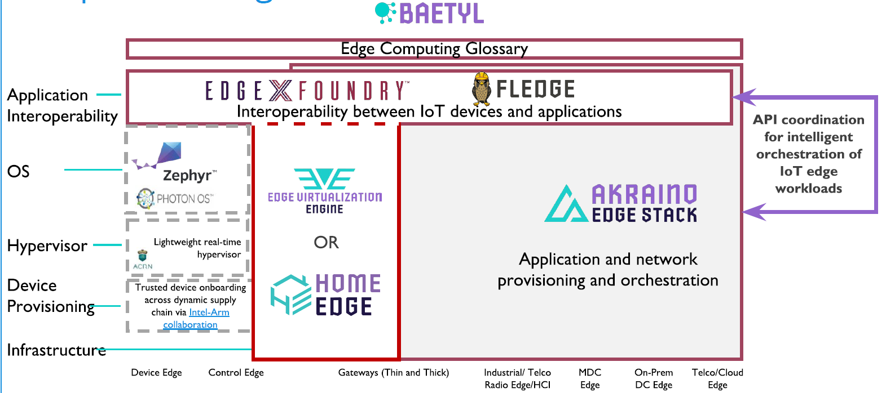

目前LF Edge开源国际组织的项目信息：

1.  Akraino Edge
    Stack：创建一个开源软件栈，提供针对边缘计算系统和应用程序优化的高可用性云服务；

2.  EdgeX Foundry：专注于构建物联网边缘计算的通用开放框架。

3.  Home Edge
    Project：由三星电子提供种子代码的一个新项目，致力于推动并实现一个强大、可靠、智能的家庭边缘计算框架、平台和生态系统，能够在我们日常生活中的各种设备上运行。

4.  Open Glossary of Edge Computing：提供了与边缘计算领域相关的术语定义。

5.  EVE（边缘虚拟化引擎）：由ZEDEDA提供，将创建一个硬件无关的开放标准边缘体系架构，以适应复杂多样的内外部硬件、网络和应用程序选择。

6.  Baetyl：Baetyl最初称为OpenEdge，由科技巨头百度创建。这将是LF
    Edge的第一阶段项目，以允许开发人员创建轻便，安全和可扩展的应用程序，同时向LF
    Edge添加云计算，数据和服务。

7.  Fledge：Dianomic的FogLAMP的新版本。该项目将在一个平台上用通用API替换专有的传感器孤岛。Fledge非常适合当前的项目，因为制造或能源等事物已使Fledge应用程序与Akraino和Project
    EVE项目互操作。

8.  Open Horizon：Open
    Horizo​​n是一个平台，用于管理容器化工作负载和机器学习相关的服务软件生命周期。它可以自动管理部署到边缘计算节点和设备的分布式Web的应用程序，而无需内部管理员。

    1.  Glossary

Glossary 边缘计算开放词汇表、边缘计算领域相关的术语

Key Links

Web Site <https://www.lfedge.org/projects/openglossary/>

GitHub <https://github.com/lf-edge/glossary>

Mail Lists <https://lists.lfedge.org/g/glossary-tsc>

<https://lists.lfedge.org/g/glossary-wg-landscape>

Slack

<https://slack.lfedge.org/>(\#glossary / \#glossary-landscape /
\#glossary-taxonomy /\#glossary-tsc)

Open Glossary of Edge Computing [v0.9.0-Beta]

<https://edge.docsend.com/view/7rm4d3d>

Calendar

<https://lists.lfedge.org/g/glossary-wg-landscape/calendar>

Akraino Edge Stack
------------------

Akraino Edge Stack
开源软件堆栈，该堆栈支持针对边缘计算系统和应用程序优化的高可用性云服务

https://www.lfedge.org/projects/akraino/

https://wiki.akraino.org/

https://wiki.akraino.org/display/AK/Documentation

https://gerrit.akraino.org/r/q/status:open

<https://github.com/akraino-edge-stack>

Key Links

Web Site <https://www.lfedge.org/projects/akraino>

Wiki <https://wiki.akraino.org/>

Gerrit <https://gerrit.akraino.org/r/#/q/status:open>

Documentation <https://wiki.akraino.org/display/AK/Documentation>

Mail Lists <https://lists.akraino.org/g/main>

Slack <https://slack.lfedge.org/>

(\#akraino / \#akraino-blueprints / \#akraino-devprojects /\#akraino-help /
\#akraino-tsc)

Technical Steering Committee (TSC)
<https://wiki.akraino.org/pages/viewpage.action?pageId=4456453>

Blueprints <https://wiki.akraino.org/pages/viewpage.action?pageId=1147243>

Calendar <https://wiki.akraino.org/pages/viewpage.action?pageId=6128052>

EdgeX Foundry
-------------

EdgeX Foundry为IoT边缘计算构建通用的开放框架，IoT Edge生态系统开放式互操作平台。

https://wiki.edgexfoundry.org/

https://github.com/edgexfoundry

https://www.edgexfoundry.org/

https://wiki.edgexfoundry.org/

<https://hub.docker.com/u/edgexfoundry>

Key Links

Web Site <https://www.lfedge.org/projects/edgexfoundry/>

Wiki <https://wiki.edgexfoundry.org/>

GitHub <https://github.com/edgexfoundry>

Documentation <https://docs.edgexfoundry.org/>

Mail Lists <https://lists.edgexfoundry.org/g/main/subgroups>

Slack <https://slack.edgexfoundry.org/>

Technical Steering Committee (TSC)
<https://wiki.edgexfoundry.org/pages/viewpage.action?pageId=329436>

Getting Started Guide <https://docs.edgexfoundry.org/Ch-GettingStarted.html>

Calendar <https://wiki.edgexfoundry.org/pages/viewpage.action?pageId=21824127>

Project EVE
-----------

Project EVE 开源边缘虚拟化引擎（EVE，Edge Virtualization
Engine）。EVE是Edge虚拟化引擎。

<https://github.com/lf-edge/eve>

<https://www.lfedge.org/projects/eve/>

<https://wiki.lfedge.org/display/EVE/Project+EVE>

<https://www.lfedge.org/projects/homeedge/>

<https://wiki.lfedge.org/display/HOME/Home+Edge+Project>

Key Links

Web Site <https://www.lfedge.org/projects/eve/>

Wiki <https://wiki.lfedge.org/display/EVE/Project+EVE>

GitHub <https://github.com/lf-edge/eve>

Documentation <https://github.com/lf-edge/eve/tree/master/docs>

Mail Lists <https://lists.lfedge.org/g/eve-tsc>

<https://lists.lfedge.org/g/eve>

Slack <https://slack.lfedge.org/>(\#eve / \#eve-help)

Baetyl 
-------

Baetyl 百度提供的“OpenEdge”，它将云计算，数据和服务无缝地扩展到边缘设备。
https://www.lfedge.org/projects/baetyl/

https://github.com/baetyl/baetyl

https://wiki.lfedge.org/display/LE/Baetyl

<https://baetyl.io/zh/>

Key Links

Web Site <https://baetyl.io/>

GitHub <https://github.com/baetyl/baetyl>

Documentation <https://baetyl.io/en/docs/overview/What-is-Baetyl>

Mail Lists <https://lists.lfedge.org/g/main/subgroups>

Slack <https://slack.lfedge.org/> (\#baetyl / \#baetyl-tsc)

WeChat <https://baetyl.cdn.bcebos.com/Wechat/Wechat-Baetyl.png>

Home Edge
---------

Home Edge
Project专注于驱动并实现一个健壮，可靠，智能的家庭边缘计算开源框架、平台和生态系统，这些框架可在日常生活中的各种设备上运行。为了成功地加速边缘计算服务生态系统的部署，“家庭边缘项目”将为用户提供一个可互操作，灵活且可扩展的边缘计算服务平台，该平台具有一组API，这些API也可以与库运行时一起运行。Home
Edge致力于推动并实现一个强大、可靠、智能的家庭边缘计算框架、平台和生态系统。

Key Links

Web Site <https://www.lfedge.org/projects/homeedge/>

Wiki <https://wiki.lfedge.org/display/HOME/Home+Edge+Project>

GitHub <https://github.com/lf-edge/edge-home-orchestration-go>

Mail Lists <https://lists.lfedge.org/g/homeedge-tsc>

Slack <https://slack.lfedge.org/>(\#homeedge / \#homeedge-tsc)

Technical Steering Committee (TSC)
<https://wiki.lfedge.org/pages/viewpage.action?pageId=1671336>

Fledge
------

Fledge专为工业边缘而设计，是工业运营商，系统集成商和设备提供商嵌入，部署，贡献和建立繁荣的工业开源社区的理想LF
Edge框架。

Key Links

Mail Lists <https://lists.lfedge.org/g/fledge>

<https://lists.lfedge.org/g/fledge-tsc>

Slack <https://slack.lfedge.org/>(\#fledge / \#fledge-help / \#fledge-tsc)

Open Horizon
------------

边缘计算使计算和数据存储距离人，地点和事物创建数据的位置更近。Open
Horizo​​n简化了将正确的应用程序和机器学习转移到正确的计算设备上的工作，并使这些应用程序保持运行和更新。它还可以同时自动管理10,000多个边缘设备，这是传统解决方案中端点数量的20倍。

<https://www.lfedge.org/projects/openhorizon/>

Openstack
=========

<https://www.openstack.org/>

<https://wiki.openstack.org/wiki/Main_Page>

OPENSTACK: 开源的云计算管理平台项目

StarlingX
---------

StarlingX是Intel和WindRiver开源的边缘计算项目。StarlingX主要面向的场景是工业IoT、电信、视频业务等对延迟要求较高的业务。并且基于Titanium
Cloud，StarlingX提供了性能兼顾高可用的特点。

StarlingX项目就是基于WindRiver的产品Titanimu Cloud R5版本基础上修改而来。
2018年5月,
Intel和风河宣布将其电信云/边缘云的商业产品TitaniumCloud中的部分组件开源,
命名为StarlingX, 并提交给OpenStack Foundation管理。

<https://www.starlingx.io/>”

<https://wiki.openstack.org/wiki/StarlingX>

<https://wiki.openstack.org/wiki/StarlingX/Docs_and_Infra>

<https://www.windriver.com/announces/starlingx-and-wind-river/>

<https://github.com/starlingx-staging>

<https://opendev.org/starlingx>

Airship
-------

AT&T、SK电信（SKT），Intel和OpenStack基金会合作推出一个名为Airship的新型云开放基础设施项目。Airship的宣传语是“声明式地定义您的OpenStack和Kubernetes基础设施”。相较于Akraino，Airship把目标聚焦于UnderCloud的部署和管理。主要的参与方包括AT&T、SK、爱立信、Mirantis、SUSE和九州云等公司。

<https://www.airshipit.org/>

<https://wiki.openstack.org/wiki/Airship>

<https://docs.airshipit.org/>

<https://wiki.openstack.org/wiki/Airship_v1.0_Release>

<https://wiki.opnfv.org/display/AIR/Airship+Installer+Deployment+Guide>

<https://github.com/airshipit>

华为
====

华为的边缘计算主要有边缘云、云化网关和服务器两类形态。

华为在边缘计算上的产品和解决方案包括四个部分：网络边缘、MEC、边缘云、边缘计算的物联网（EC-IoT）。

边缘云产品包括智能边缘平台 IEF、5G 边缘计算平台 MEC、ROBO 一体机等；

云化网关，包含边缘计算物联网 EC-IoT 解决方案、CloudWAN
解决方案等，覆盖智慧园区、平安城市等多种场景。另外，华为还发起了 MEC
边缘计算开源项目 EdgeGallery。

华为边缘计算物联网解决方案包括：物联网操作系统
LiteOS、敏捷控制器、敏捷物联网关三个部分。目前，华为边缘计算成功案例,如：

梯联网，基于边缘计算和云管理架构，实现百万级电梯统一管理，故障预知，业务中断时间降低70%，运维成本减低50%；

智能配电，边缘计算助力国网低压配网数字化，提高运检效率；

智慧水务，基于EC-IoT的智慧水务解决方案，构建智慧水务行业物联网。

智能边缘平台（Intelligent EdgeFabric
）满足客户对边缘计算资源的远程管控、数据处理、分析决策、智能化的诉求，
为用户提供完整的边缘和云协同的一体化服务

1.  LiteOS

2.  KubeEdge

KubeEdge即Kube+Edge，顾名思义就是依托K8s的容器编排和调度能力，实现云边协同、计算下沉、海量设备的平滑接入。KubeEdge是一个支持边缘计算开放平台的开源系统，用于将容器化应用程序编排功能扩展到Edge的主机。基于kubernetes构建，并为网络应用程序提供基础架构支持。云和边缘之间的部署和元数据同步。

<https://github.com/kubeedge/kubeedge>

<https://kubeedge.io/en/>

<https://docs.kubeedge.io/en/latest/>

KubeEdge的目标是创建一个开放平台，使能边缘计算，将容器化应用编排功能扩展到边缘的节点和设备，后者基于kubernetes构建，并为云和边缘之间的网络，应用部署和元数据同步提供基础架构支持。

KubeEdge有以下几个特点：

1.  KubeEdge构建在Kubernetes之上，100%兼容K8S API，可以使用K8S
    API原语管理边缘节点和设备；

2.  为了让K8S应用能够跑在边缘上，深度定制和优化了runtime；

3.  为了应对边缘侧的网络不稳定因素，设计了可靠的消息通道；

4.  边缘适应本地自治；

5.  丰富的应用和协议支持；

6.  大大简化了设备的接入复杂度；

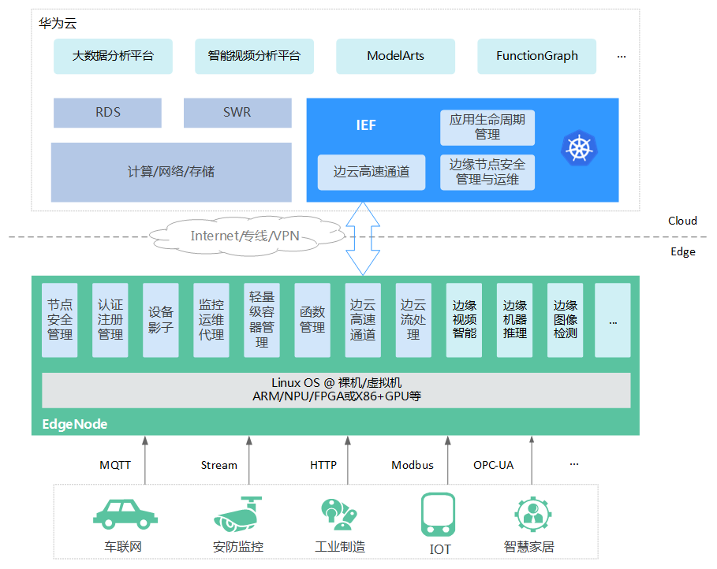

上图是 **华为云IEF**
(<https://www.huaweicloud.com/product/ief.html>)的应用场景，Kubeedge就是源于这个产品，它基于KubeEdge和Kubernetes生态构建，将云原生的技术应用到边缘计算。IEF通过纳管边缘节点，将云端AI应用、函数计算等能力下发到边缘节点（EdgeNode），将公有云能力延伸到靠近设备的一端，使得边缘节点拥有云端相同能力，能够实时处理终端设备计算需求。

1.  MEC\@CloudEdge

2.  EdgeGallery

Alibaba
=======

IoT 边缘计算产品 Link Edge 和边缘节点服务
ENS，将其在云计算、大数据、人工智能的优势拓宽到边缘计算上。

2019
年，阿里云定义边缘计算即城市计算，持续加码四层技术栈的投入布局，以地级市为单位逐渐部署边缘云基础设施。

Openyurt
--------

阿里云容器服务 ACK\@Edge（边缘集群托管服务）
发布一周年之际，阿里巴巴正式对外宣布将其核心能力开源，并向社区贡献完整的边缘计算云原生项目。

OpenYurt
沿用了目前业界流行的“中心管控、边缘自治”的边缘应用管理架构，将“云边端一体化协同”作为目标，赋能云原生能力向边缘端拓展。在技术实现上，OpenYurt
贯彻了“Extending your native Kubernetes to
Edge”的核心设计理念，其技术方案有如下特点：

1.  对原生 Kubernetes“零”侵入，保证对原生 K8s API 的完全兼容。不改动 Kubernetes
    核心组件，并不意味着 OpenYurt 是一个简单的 Kubernetes Addon。OpenYurt 通过
    proxy node network traffic，对 Kubernetes
    节点应用生命周期管理加了一层新的封装，提供边缘计算所需要的核心管控能力。

2.  无缝转换，OpenYurt 提供了工具将原生
    Kubernetes“一键式”转换成支持边缘计算能力的 Kubernetes 集群。

3.  低 Overhead，OpenYurt
    参考了大量边缘计算场景的实际需求，在保证功能和可靠性的基础上，本着最小化，最简化的设计理念，严格限制新增组件的资源诉求。

以上技术特点使得 OpenYurt 能够实现：

1.  最大程度保证用户在管理边缘应用时获得和管理云端应用一致的体验。

2.  兼容所有云厂商的 Kubernetes 服务，易于集成。

3.  保持极低的运维成本。

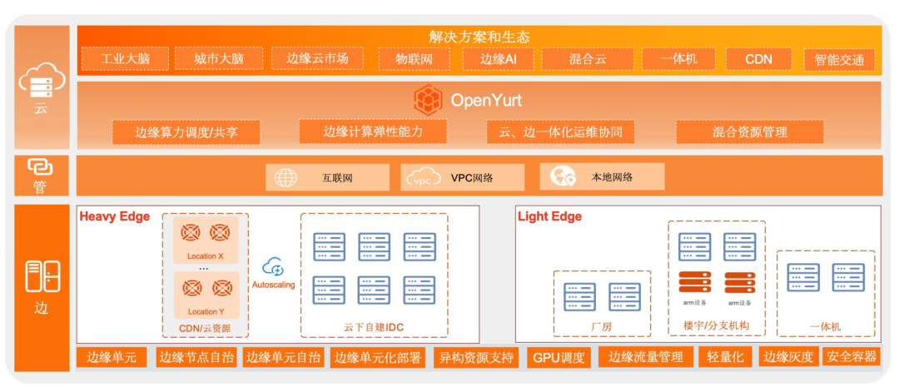

https://github.com/alibaba/openyurt

Link IoT Edge
-------------

LinkEdge将阿里云的计算能力扩展至边缘，在离设备最近的位置执行计算，提供安全可靠、低延时、低成本、易扩展的本地计算服务，能够大大提升处理效率，减轻云端的负荷，提供更快的响应，将需求在边缘端解决，是IoT服务不可缺少的环节。

Baidu
=====

2019 年 8 月，在百度云智能峰会上，百度智能云率先基于 CDN
节点网络推出边缘计算产品 BEC（Baidu Edge
Computing）。在边缘计算场景，百度智能云还研发了边缘 AI
服务器，结合云端软件解决方案，提供更好的服务和体验。2018 年 12
月，百度云推出了中国国内首个开源边缘计算平台 Open
Edge，旨在打造一个轻量、安全、可靠、可扩展性强的边缘计算社区。

智能边缘计算产品BIE（Baidu Intelligent
Edge）和智能边缘计算开源版本OpenEdge(baetyl)也是中国第一个同时实现商业化和开源的边缘计算产品。此外，百度还与英特尔和恩智浦联手推出搭载百度智能边缘技术的硬件产品BIE-AI-BOX和BIE-AI-Board。

智能边缘BIE，将云计算能力拓展至用户现场，可以提供临时离线、低延时的计算服务，包括消息规则、函数计算、AI
推断。智能边缘配合百度智能云，形成“云管理，端计算”的端云一体解决方案

<https://cloud.baidu.com/product/bie.html>

百度智能云智能边缘(IoT Intelligent Edge)

<https://cloud.baidu.com/solution/iot/intelligent_edge.html>

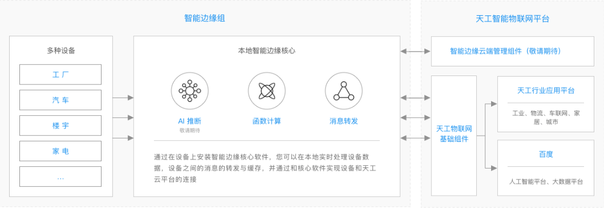

OTE-Stack
---------

OTE-Stack（Over The Edge
Stack：百度边缘资源统一接入平台）是面向5G和AI的开源边缘计算平台，致力于实现多种边缘资源的统一接入，通过边缘资源的虚拟化，集群管理和智能调度，屏蔽底层异构的特性，提高资源利用率，降低接入门槛；作为边缘基础设施，支撑Device-Edge-Center算力的统一调度，为AI提供低延时，高可靠，成本最优的边缘算力支持。

<https://github.com/baidu/ote-stack>

OpenEdge
--------

OpenEdge是百度云自研的边缘计算框架，主要是为了贴合工业互联网应用，将计算能力拓展至用户现场，提供临时离线、低延时的计算服务，包括消息路由、函数计算、AI推断等。OpenEdge和云端管理套件配合使用，可达到云端管理和应用下发，边缘设备上运行应用的效果，满足各种边缘计算场景。

<https://openedge.tech>*或*<https://openedge.tech/zh/>

<https://github.com/baidu/openedge>或<https://github.com/baetyl/baetyl>

ONF
===

开放网络基金会(Open Networking Foundation: ONF) 2011年由Deutsche Telekom,
Facebook, Google, Microsoft, Verizon, 和
Yahoo!创立，作为仍在发展壮大中的非盈利组织，ONF已经拥有140多家会员，其共同使命是加速开放SDN的部署。ONF推广开放SDN和OpenFlow技术及标准，促进产品，服务，应用，客户和用户市场的发展。

ONF旗下有SDN控制器ONOS、虚拟化数据中心CORD、轻量级软件定义网络和测试平台MININET三个平台，以及下一代移动网络的解决方案M-CORD、住宅宽带接入解决方案R-CORD、企业网络解决方案R-CORD、下一代WAN的解决方案ODTN、用于数据中心网络的Spine-Leaf交换结构TRELLIS、提供多厂商住宅宽带的解决方案VOLTHA、CORD控制器XOS和开源SDN交换平台Stratum。

<https://www.opennetworking.org/>

<https://www.opennetworking.org/onf-edge-cloud-platforms/>

CORD
----

CORD是为网络运营商推出的开源项目，旨在利用软件定义网络（SDN）、网络功能虚拟化（NFV）和云计算技术重构现有的网络边缘基础设施，并将其打造成可灵活地提供计算和网
络服务的数据中心。现有网络边缘基础设施构建于由电信设备供应商提供的封闭式专有的软硬件系统，不具备可扩展性，无法动态调整基础设备的规模，导致资源的低效利用。

CORD计划利用商用硬件和开源软件打造可扩展的边缘网络基础设施，并实现灵活的服务提供平台，支持用户的自定义应用。

<https://www.opennetworking.org/cord/>

Aether
------

ONF推出Aether™第一个用于5G /
LTE边缘云即服务的开源平台。Aether是第一个开源企业级5G /
LTE边缘云即服务平台（ECaaS）。它为分布式企业网络提供移动连接和边缘云服务，所有这些都通过集中式云进行配置和管理。

Aether是一个针对多云部署进行了优化的开源平台，它同时支持许可，未许可和轻许可（CBRS）频谱上的无线设备。

Aether由运行在公有云中的核心站点或集中式云中的站点，以及一些边缘站点组成，每个边缘站点都有这三个关键组件：专用5G/LTE网络组件、SD-RAN开放式RAN控制器和运行边缘云应用程序的能力。Aether控制和平台和一个能够统一整个网络的控制台。网络被监控、和维护，个人用户认证、和跟踪都集中完成。

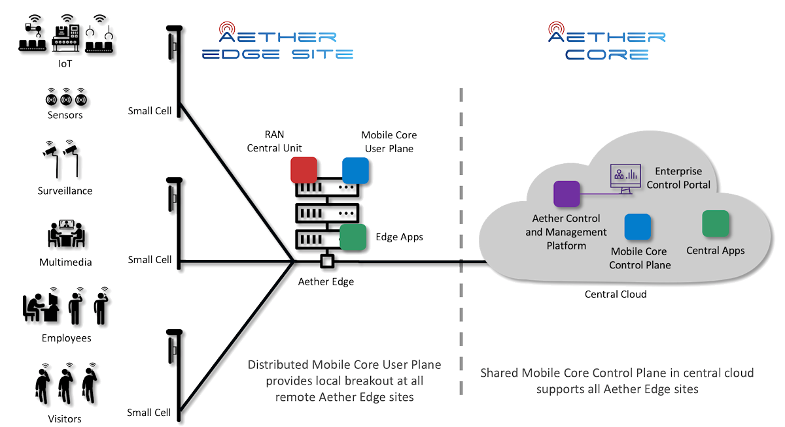

<https://www.opennetworking.org/aether/>

XOS
---

XOS是用于组装，控制和组合服务的基于模型的平台。它定义了一个控制平面服务，该服务位于各种后端服务实现的基础之上，这些实现包括在白盒交换机中嵌入的VM托管VNF功能，基于容器的微服务和基于SDN的控制程序。

XOS围绕“一切即服务”（XaaS）原则进行设计，使其成为CORD
™（将中央办公室重新架构为数据中心）的组成部分 。

XOS以编程方式定义了CORD的体系结构，其中包含一组模型和不变量作为体系结构的规范，以及生成工具链，该工具链将声明性规范转换为可执行代码。

<https://www.opennetworking.org/xos/>

Cloudlet
========

Cloudlet，又称随我云（follow me cloud）、移动微云（mobile
micro-cloud），派生于卡内基梅隆大学的Elijah项目，由OpenEdgeComputing.org组织推动，用于支持资源密集型和交互式的移动应用程序，满足增强现实应用、远程渲染的云游戏等低延迟、高带宽的需求。Cloudlet主要包括四大特性：仅以软件形态部署、具备计算/连接/安全能力、就近部署、基于标准云技术构建等。

<https://github.com/cmusatyalab/elijah-cloudlet>

<http://elijah.cs.cmu.edu/>

<http://elijah.cs.cmu.edu/publications.html>

<https://en.wikipedia.org/wiki/Cloudlet>

<http://elijah.cs.cmu.edu/development.html>

ParaDrop
========

ParaDrop是由威斯康星大学麦迪逊分校的WiNGS实验室开发的开源边缘计算平台。基于Wi-Fi路由器的边缘计算平台，用于管理边缘Wi-Fi接入点中运行的应用程序。目标是通过商用Wi-Fi
AP硬件将网络智能带入家庭。灵活，安全，轻量级的容器虚拟化和多租户平台，允许基于网络的方法来实现与应用程序无关服务。

<https://paradrop.org/>

<https://github.com/ParadropLabs/Paradrop>

<https://paradrop.readthedocs.io/en/latest/>

Project Flogo 
==============

Flogo项目是一个开放源代码的生态系统，具有自发的事件驱动功能，可简化构建高效，现代的无服务器功能，微服务和边缘应用程序的过程。
是一个资源高效的，基于Go的开源生态系统，用于构建事件驱动的应用程序。旨在从事件消耗中抽象事件处理范例，使开发人员可以一次构建，从任何地方使用并使用任何受支持的动作进行处理。

Project Flogo是一个IoT
Edge应用程序和集成的开源框架。用于构建在边缘设备上运行的IoT应用程序，并将其快速集成到IoT网关和云服务（如
AWS IoT 或 Microsoft Azure IoT
Hub）中。它是一个轻量级的流程引擎，其宣称所占用的内存，比Java或NodeRed少20到50倍。

TIBCO Flogo® Enterprise软件—完全受商业支持的开源版本Project Flogo®
框架—可帮助开发人员使用基于浏览器的流设计器轻松构建超轻型的事件驱动型微服务和功能。这些应用可无缝部署到无服务器环境、容器平台和位于网络边缘的设备中。使用Flogo®
Enterprise软件，您可以构建高度可扩展的功能，创建愉悦的用户体验，以及在IoT设备上收集并分析数据。

<https://www.tibco.com/zh-hans/products/tibco-flogo>

<http://www.flogo.io/>

<https://tibcosoftware.github.io/flogo/>

<https://www.tibco.com/zh-hans/solutions-2>

<https://github.com/TIBCOSoftware/flogo>

<https://github.com/project-flogo>

<https://tibcosoftware.github.io/flogo/>

openVolcano
===========

openVolcano平台旨在在支持5G的基础架构中，支持移动边缘和雾计算服务。

openVolcano平台是通过高度模块化和可扩展的架构设计的，提供了许多最新一代的API，协议和接口（例如，从OpenStack到OpenFlow，libVirt和ETSI
NFV）。OpenVolcano提供了一个完整的解决方案堆栈。

OpenVolcano是一个开源项目，源于DROP项目，由CNIT S3ITI实验室领导。它是在Horizo​​n
2020 INPUT项目的背景下构思的，它将成为Horizo​​n 2020 5G-PPP
MATILDA创新行动的参考平台之一。

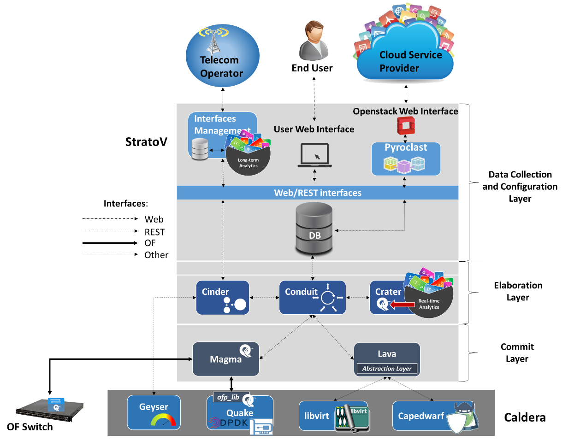

http://openvolcano.org/

http://openvolcano.org/dokuwiki/doku.php?id=ov:download

Eclipse
=======

Eclipse Foundation是物联网领域最成熟的开源社区之一。Eclipse
IoT创建于6年前，拥有30多个开源项目，其中也包括许多用于边缘计算的项目。

Eclipse基金会宣布释放了多个物联网项目，包括Eclipse
Kura（构建IoT网关的框架）、Eclipse Paho（MQTT协议的实现）、Eclipse
OM2M（SmartM2M和oneM2M标准的开源实现）以及Eclipse
SmartHome（构建智能家居解决方案的开源框架），基于Java、实现受限制的应用协议(CoAP)的项目，名为Californium。

<https://github.com/eclipse>

<https://projects.eclipse.org/>

<https://projects.eclipse.org/projects/iot>

<https://awesomeopensource.com/projects/eclipseiot>

Eclipse Kura
------------

Eclipse Kura是Eclipse的边缘计算项目，其中也包含了Eclipse ioFog和Eclipse
fogO5，它们创造了新的边缘计算技术。Eclipse还承载了边缘计算所需的流行行业标准的实现，例如MQTT，OPC-UA，DDS，CoAP和LWM2M。

<https://www.eclipse.org/kura/>

<https://www.eclipse.org/kura/downloads.php>

<https://github.com/eclipse/kura>

<https://eclipse.github.io/kura/>

Eclipse [i](https://www.starlingx.io/)oFog
------------------------------------------

dgeworx - Edgeworx ioFog

ioFog使在边缘部署和管理任何应用程序或容器化微服务变得简单。ioFog通过使任何设备或硬件成为安全的软件平台，允许用户“发挥自己的优势”。

Eclipse
ioFog软件版本，该版本使任何Kubernetes发行版都具有边缘感知能力，从而使客户能够创建真正的云到边缘连续体并部署应用程序和微服务从云到任何边缘设备。

https://projects.eclipse.org/projects/iot.iofog

<https://github.com/eclipse-iofog>

<https://github.com/eclipse-iofog/iofog.org/tree/develop>

<https://iofog.org/docs/2/getting-started/whats-new.html>

Edgeworx是一家位于美国硅谷的边缘计算创业公司。该公司的技术，即Eclipse
Foundation下开源的ioFog平台，可以将任何计算设备转变为边缘软件平台。

Edgeworx公司通过Eclipse基础提供ioFog技术作为开源，Edgeworx提供了一个可在任何行业和任何设备上运行的水平边缘计算平台。该公司使开发人员能够构建优势，使他们能够在边缘轻松部署高级AI和机器学习算法，以执行诸如实时视频流分析，自然语言处理，流分析等任务。

部署Edgeworx
Fabric™将您的云扩展到Edge。协调，部署，保护和监视从云到边缘的任何基础架构中的任何微服务。

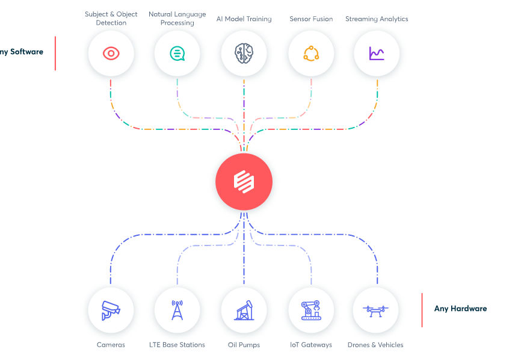

https://edgeworx.io/

<https://edgeworx.io/kubernetes>

OpenNESS
========

OpenNESS（Open Network Edge Services
Software）是一个开源的边缘应用程序管理系统，使服务提供商和企业能够在任何网络的边缘上构建、部署和操作自己的边缘应用程序（ME
APP），支持通过简易的方式将运行在 Telco/Public Cloud 中的 APP
迁移到边缘。同时，OpenNESS
还是一个边缘网络的服务平台，支持在多云环境中跨越多种类型的网络平台（Network
Platform，e.g. NTS、OvS、vPP）以及多种类型的访问技术（Access Technologies，e.g.
S1_U、SGi、IP）。让用户能够轻松的编排和管理运行在边缘上的应用程序，并为客户端（UE）和边缘应用程序提供端到端（End
to End）的网络连接服务。

OpenNESS 与 ETSI MEC

简而言之，OpenNESS 就是一个可以充当 ETSI MEC 参考模型中的 MEPM、MEP 以及 Data
Plane 角色的平台级开源软件。

<https://blog.csdn.net/Jmilk/article/details/102603127>

<https://www.openness.org/>

<https://www.openness.org/developers#softwarerelease>

<https://github.com/open-ness>

1.  NFV

    1.  OpenNFV

OPNFV，全名 Open Platform for NFV ，即 NFV 开放平台，旨在帮助各种开源生态系统的
NFV
组件的开发和演进。该项目将标准机构、开源社区和厂商的工作结合起来，为业界提供高可实践性的参考性
NFV 平台，加速企业和服务提供商的转型。

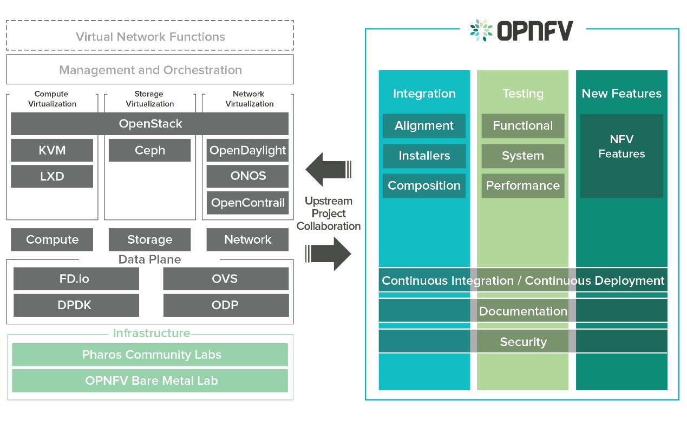

1.  SDN

    1.  OpenDaylight

    2.  ONF

<https://www.opennetworking.org/onf-sdn-projects/>

1.  STRATUM

2.  TRELLIS

3.  NG-SDN

4.  P4

5.  ODTN

6.  ONOS

开源网络操作系统Open Network Operating System
(ONOS®)，是由ON.Lab使用Java及Apache实现发布的首款开源的SDN网络操作系统，主要面向服务提供商和企业骨干网。ONOS的设计宗旨是满
足网络需求实现可靠性强、性能好、灵活度高。此外，ONOS的北向接口抽象层和API支持简单的应用开发，而通过南向接口抽象层和接口则可以管控
OpenFlow或者传统设备。

ONOS是业界首个面向运营商业务场景的开源SDN控制器平台，由业界顶级运营商和最有综合实力的设备商共同创建和主导，重点聚焦运营商网络和业务场景，
充分考虑了运营商高性能、高可靠性、安全和高扩展性的需求，具备良好的初始架构设计，因而更符合运营商面向未来的业务与网络发展的战略要求，能够端到端地
支撑运营商从WAN到数据中心的业务按需、实时、自动化的部署，及资源分配和优化调整需求。

<https://wiki.onosproject.org/>

<https://www.opennetworking.org/onos/>

1.  OTCC

2.  INFORMATION MODELING

3.  MININET

CDN
===

squid，vanish，apache traffic server(ATS)，nginx、OpenResty

OpenCDN
-------

OpenCDN是一套快速部署CDN加速的工具，针对专门提供CDN加速服务的企业或对多节点CDN加速有需求的企业，提供一套便捷的CDN加速管理平台，可对每一个节点的状态、系统负载进行实时监测与统一管理，同时我们预制了多套常用缓存规则，支持多种复杂的CDN缓存场景。

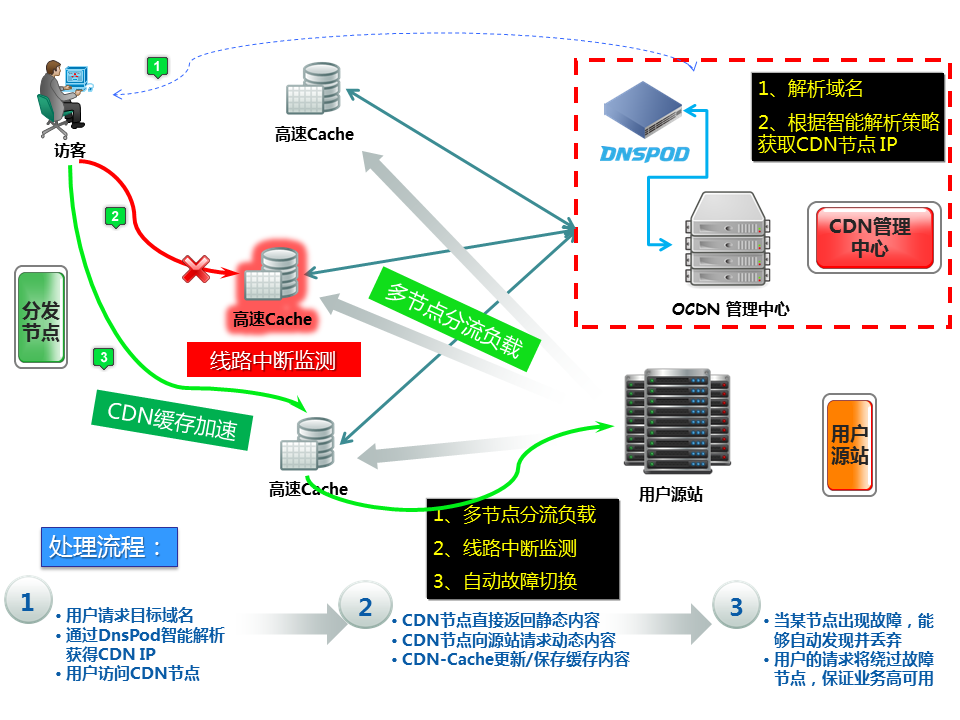

<https://github.com/zooboa/OpenCDN>

<https://github.com/firefoxbug/OpenCDN>

<http://ocdn.me/>

OpenResty
---------

OpenResty® 是一个基于 Nginx 与 Lua 的高性能 Web 平台，其内部集成了大量精良的 Lua
库、第三方模块以及大多数的依赖项。用于方便地搭建能够处理超高并发、扩展性极高的动态
Web 应用、Web 服务和动态网关。

OpenResty® 通过汇聚各种设计精良的 Nginx 模块（主要由 OpenResty
团队自主开发），从而将 Nginx 有效地变成一个强大的通用 Web 应用平台。这样，Web
开发人员和系统工程师可以使用 Lua 脚本语言调动 Nginx 支持的各种 C 以及 Lua
模块，快速构造出足以胜任 10K 乃至 1000K 以上单机并发连接的高性能 Web 应用系统。

OpenResty® 的目标是让你的Web服务直接跑在 Nginx 服务内部，充分利用 Nginx 的非阻塞
I/O 模型，不仅仅对 HTTP 客户端请求,甚至于对远程后端诸如
MySQL、PostgreSQL、Memcached 以及 Redis 等都进行一致的高性能响应。

<http://openresty.org/cn/>

Fly
---

Fly运行时是构建用于运行Edge应用程序的开源Javascript环境。它为开发人员提供了强大的缓存，内容修改和路由工具。

[https://fly.io](https://fly.io/)

<https://github.com/superfly/fly>

OpenMANO
========

OpenVIM

1.  AR/VR

    1.  OpenXR

https://www.khronos.org/openxr

OpenXR简介：定位在一个介绍类知识，对于没有OpenVR知识的一个探索总结；

OpenVR的Github：https://github.com/ValveSoftware/openvr

OpenXR官网：https://www.khronos.org/openxr

OpenXR™工作组（以前称为Khronos VR
Initiative）正在为VR和AR应用程序和设备创建一个开放且免版税的标准。

OpenAR
------

<http://openar.sourceforge.net/>

<https://github.com/bharathp666/openAR>

<https://www.meetup.com/Open-AR-Cloud/>

IoT
===

<https://www.oschina.net/project/tag/417/iot>

<https://awesomeopensource.com/projects/iot>

<https://awesomeopensource.com/projects/iot-platform>

<https://awesomeopensource.com/projects/iot-framework>

<https://github.com/topics/iot>

<https://github.com/phodal/awesome-iot>

Fogflow
-------

[FogFlow是基于标准的IoT雾计算框架，它通过高级编程模型支持无服务器计算和边缘计算](https://awesomeopensource.com/project/smartfog/fogflow?categoryPage=41)。

<https://fogflow.readthedocs.io>

<https://github.com/smartfog/fogflow>

Kuiper
------

EMQ X
Kuiper是Golang实施的一种边缘轻量级IoT数据分析/流软件，它可以在各种资源受限的边缘设备上运行。Kuiper的目标之一是将云流软件框架（例如Apache
Spark，Apache Storm和Apache
Flink）迁移到边缘。柯伊伯引用这些云流框架和边缘分析的也算特殊要求，并介绍了规则引擎，它是基于Source，SQL
(business logic)并且Sink，规则引擎，用于在边侧开发流媒体应用。

<https://emqx.io/>

<https://github.com/emqx/kuiper>

Azure IoT Edge
--------------

Azure IoT
Edge将云分析和自定义业务逻辑移至设备，以便您的组织可以专注于业务洞察力而不是数据管理。通过配置IoT软件，通过标准容器将其部署到设备并从云进行监视，从而使您的解决方案能够真正地扩展。该存储库包含三个主要项目：Edge
Agent，Edge Hub和IoT Edge Security守护程序。

<https://github.com/azure/iotedge>

<https://github.com/azure/azure-iotedge>

Mainflux
--------

工业物联网消息传递和设备管理平台。Mainflux是用Go编写的现代，可扩展，安全，开源的IoT云平台。它通过各种网络协议（即HTTP，MQTT，WebSocket，CoAP）接受用户和事物连接，从而在它们之间建立了无缝的桥梁。它用作构建复杂的IoT解决方案的IoT中间件。

[https://www.mainflux.com](https://www.mainflux.com/)

<https://github.com/mainflux/mainflux>

IoTivity
--------

IoTivity是一个开放源代码软件项目，可实现无缝的设备到设备连接，数十亿个有线和无线的物联网（IoT）设备可以安全地相互连接并连接到Internet。

Open Connectivity
Foundation(IoTivity)，英特尔和三星支持的开放互联联盟(OIC)组织和UPnP论坛组成的这个组织正在努力成为物联网方面领先的开源标准组织。OCF的开源IoTivity项目依赖充分利用的JSON和CoAP。

https://iotivity.org/

<https://github.com/iotivity/iotivity>

1.  HSA

2.  Kaa

Kaa物联网平台，Kaa
Enterprise提供企业版物联网平台。任何物联网公司，物联网系统集成商或个人都可以免费实现其智能产品概念。通过提供服务器和端点SDK组件，Kaa可以为连接的对象和后端基础架构提供数据管理。

Kaa关键物联网功能：

1.  管理无限数量的连接设备

2.  建立跨设备互操作性

3.  执行A/B服务测试
    （随机将测试用户群分为2部分，用户群1使用A方案，用户群2使用B方案，经过一定测试时间后，根据收集到的两方案样本观测数据，根据显著性检验结果选取最好方案。）

4.  执行实时设备监控

5.  执行远程设备准备和配置

6.  收集并分析传感器数据

7.  分析用户行为可提供有针对性的通知

8.  为智能产品创建云服务

<https://www.kaaproject.org/>

<https://github.com/kaaproject/kaa>

Cloud IoT Core
--------------

Cloud IoT Core 一种完全托管式服务，可以帮助用户安全地连接和管理大规模的IoT设备

https://cloud.google.com/iot-core/

<https://cloud.google.com/iot/docs/quickstart>

DSA
---

DSA: Open Source Platform & “Toolkit” for Internet Of Things Devices

分布式服务体系结构（DSA）是一个开源的物联网平台，它将结构化和实时数据模型中的各个设备，服务和应用程序统一起来。它有利于分散设备的互通，逻辑和应用程序。
DSA社区构建了一个图书馆分布式服务链接，允许协议翻译和数据集成到第三方数据源和从第三方数据源进行数据集成所有DSA模块都很轻便，可以将DSBroker，多个DSLink和客户端Web应用程序连接到相同的低功率设备上，例如Raspberry
PI，Beaglebone
black或任何其他类似的计算平台。这个基于NodeAPI，DSLink和DSBroker的开源IoT平台。计划为第三方处理系统提供Analytics（分析）支持的DSA社区包括R
Project，RDBMS，JDBC SQL passthrough和预准备语句，Haystack DSLink，Niagara
DSLink，OS X DSLink，Windows DSLink和nix DSLink。

DSA开源IoT平台的关键特性：

1.  指定M2M授权生命周期

2.  公开WebSocket / HTTP端点以订阅来自代理的节点和值更改

3.  实施DSA查询DSL

4.  硬件集成支持：Dreamplug，Beaglebone，Raspberry PI，Android DSLink，OS X
    DSLink，Windows DSLink和nix DSLink

5.  该平台建立在三个

6.  轻量级模块

http://www.iot-dsa.org/

<https://github.com/IOT-DSA>

<https://github.com/IOT-DSA/docs/wiki>

Thinger.io
----------

Thinger.io: The Opensource Platform for Internet of things

Thinger.io是IoT的开源平台，可为连接设备或物品提供可扩展的云基础架构。
您可以使用管理控制台轻松控制它们，或使用其REST API将它们集成到项目逻辑中。
IT支持所有类型的黑客板，如Arduino，ESP8266，Raspberry Pi，Intel Edison。

Thinger.io开源的物联网平台主要特点：

1.  实时仪表板

2.  Docker和IFTT集成

3.  云准备好了

4.  将服务器安装在您自己的云中，并使用开放源代码库连接您的设备。

<https://thinger.io/>

<https://github.com/thinger-io>

WSo2
----

WSo2- Open source platform for Internet of Things and mobile projects

WSo2 Build允许公开API来为移动应用提供支持，允许用户监控和控制他们的设备。
您可以将其与现有的身份系统集成，或使用他们的身份系统。
该物联网平台还支持几乎所有已知的开发板设备，如Raspberry Pi，Arduino
Uno等。边缘计算由WSO2 Siddhi提供支持。

设备通信支持的协议包括MQTT，HTTP，Websockets和XMPP协议以及用于添加更多协议和数据格式的IoT
Server Framework扩展。

WSo2开源的物联网平台主要特点：

1.  通过WSO2数据分析服务器（DAS），它支持批量，交互式，实时和预测性分析。

2.  基于位置的服务（地理围栏）和警报作为可重用的功能

3.  MQTT，HTTP，Websockets和XMPP协议

4.  为多个注册设备配置/取消配置应用程序

5.  为iOS，Android和Windows设备实施自助设备注册和管理

6.  分配和管理设备的应用程序/固件

7.  分组，管理和监视连接的设备

8.  API驱动的设备类型定义

9.  查看单个或多个设备的即时可视化统计信息

10. Stats-API编写您自己的可视化文件

11. 预制的普通传感器图

<https://wso2.com/iot>

<https://github.com/wso2>

Meta-ACRN
---------

Meta-ACRN ACRN 是 Linux
基金会发布的开源项目，这是一个专为物联网和嵌入式设备设计的管理程序

<https://projectacrn.org>

<https://github.com/intel/meta-acrn>

SAP IoT
-------

微服务架构的边缘计算网关软件。也是基于OSGi运行时的。

OpenIoT 
--------

这款基于Java的OpenIoT中间件旨在使用一种公用云计算交付模式，为开放、大规模的物联网应用提供便利。除了表示物联网物件的本体、语义模型和标注外，该平台还包括传感器和传感器网络中间件。

1.  IoTSys

2.  OpenRemote

OpenRemote为家庭和楼宇自动化而设计，它以广泛支持众多智能设备和网络规范而出名，比如1-Wire、EnOcean、
xPL、Insteon和X10等规范。规则、脚本和事件都得到支持，还有基于云的设计工具，可用于用户界面、安装、配置、远程更新及诊断。

OpenThread
----------

这是Nest最近从基于6LoWPAN的物联网Thread无线网络标准分离出来的开源项目，它还得到了ARM、Microchip旗下的Atmel、Dialog、高通和德州仪器的支持。OpenThread实现了所有Thread网络层，还实现了Thread的端点设备、路由器、Leader和边界路由器等角色。

1.  openHAB

2.  The Thing System

基于Node.js的智能家居“监管”软件声称支持真正的自动化，而不是简单的通知。其自学习人工智能软件可处理许多协同式M2M操作，不需要由人干预。缺少云组件恰恰提供了更好的安全性、隐私性和控制性。

1.  ThingBox

2.  ThingSpeak

ThingSpeak是物联网（IoT）平台，可让您在不从Mathworks购买许可证的情况下分析和可视化MATLAB中的数据。
IT允许您收集和存储传感器数据并开发物联网应用程序。 它适用于Arduino，Particle
Photon和Electron，ESP8266 Wifi模块，BeagleBone Black，Raspberry
Pi，移动和网络应用，Twitter，Twilio和MATLAB，以将传感器数据传到ThingSpeak。
ThingSpeak主要关注传感器记录，位置跟踪，触发和警报以及分析

ThingSpeak开放源码物联网平台关键物联网特性

1.  在私人渠道收集数据

2.  与公共频道共享数据

3.  RESTful和MQTT API

4.  MATLAB分析和可视化

5.  警报

6.  事件调度

7.  应用程序集成

8.  全球社区

<https://thingspeak.com/>

Zetta
-----

Zetta是一个基于Node.js构建的面向服务器的开源IoT平台。 Zetta结合了REST
API，WebSockets和反应式编程。
它可以在单板计算机，个人电脑或云上运行，并且能够将诸如Linux，BeagleBones，Raspberry
Pis，Arduino开发板和PC等不同平台与Heroku等云平台连接在一起，以创建地理分布式网络。
您还可以将数据传输到Splunk等机器分析平台。

Zetta开源的物联网平台的关键特性：

1.  基于Node.js，REST，WebSockets和基于流的“响应式编程”构建。

2.  支持广泛的开发板

3.  Zetta允许您组装智能手机应用程序，设备应用程序和云应用程序

<http://www.zettajs.org/>

<https://github.com/zettajs>

<https://github.com/zettajs/zetta/wiki>

AllJoyn
-------

AllSeen Alliance(AllJoyn)

AllSeen Alliance是由The Linux
Foundation主持的一个协作项目，参与成员包括了许多顶级的电子制造商，如海尔、LG、松下、夏普等，以及像高通、Silicon
Image及TP-LINK之类的技术/芯片公司，联盟致力于实现家庭、医疗保健、汽车、教育等行业的跨设备互联。

该项目以开源项目AllJoyn为基础，后者首先由高通发起，其目标是让各色各样的设备、应用及服务都能通过各种在线或离线渠道（如WiFi、电线或以太网）进行连接。AllJoyn不需要互联网连接，且设计为跨操作系统及平台连接。

开放互连基金会 (Open Connectivity Foundation，OSF) 和 AllSeen Alliance
宣布它们决定以OCF 的名称及章程合并。这次合并的目的是使用同一IoT
标准去联合所有的力量，以使所有的IoT 设备可互操作。

该官方声明提及在新的 OCF 中， IoTivity 项目和 AllJoyn 架构将继续得到发展。

http://www.allseenalliance.org

1.  TencentOS tiny

2.  HarmonyOS

3.  SiteWhere

Sitewhere是提供设备数据的摄取，存储，处理和集成的另一个开源IoT平台。SiteWhere运行在Apache
Tomcat提供的核心服务器上。它提供高度调整的MongoDB和HBase实现。
它可以轻松与黑客板集成。

SiteWhere关键的物联网功能：

1.  在单个SiteWhere实例上运行任意数量的IoT应用程序

2.  Spring提供了核心配置框架

3.  用MQTT，AMQP，Stomp和其他协议连接设备

4.  通过自注册，REST服务或批量添加设备

5.  与第三方集成框架（如Mule AnyPoint）集成

6.  默认的数据库存储是MongoDB

7.  Eclipse Californium进行CoAP消息传递

8.  InfluxDB用于事件数据存储

9.  Grafana可视化SiteWhere数据

10. HBase用于非关系数据存储

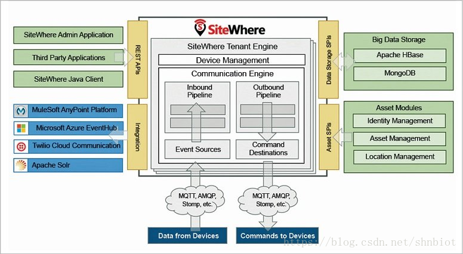

<http://www.sitewhere.org/>

1.  EMQX

2.  IoT Edge Connect

。

FogLAMP
-------

FogLAMP
工业物联网（IIoT）开源项目，并且是基本的雾计算组件。FogLAMP使用可插拔的模块化架构来轻松连接任何/所有传感器，机器和IIoT设备，管理其数据并将其转发给历史学家（例如OSIsoft的PI），企业系统和云。

http://foglamp.readthedocs.io/

https://foglamp.readthedocs.io/en/master/

https://github.com/foglamp/FogLAMP

https://foglamp.readthedocs.io/en/1.3/01_introduction.html

https://foglamp.readthedocs.io/en/latest/foglamp_architecture.html

https://dianomic.com/

https://www.osisoft.com/

Fledge
------

Fledge是面向工业领域的开源框架和社区，重点关注关键操作，预测性维护，态势感知和安全性。由Dianomic贡献，以前称为“
FogLAMP”。 Fledge架构集成了IIoT，传感器和现代机器，以及工业“brown
field”系统，分布式控制系统（DCS、Distributed Control
Systems）、程序逻辑控制器（PLC，Program Logic
Controllers）、监控和数据采集（SCADA，Supervisory Control and Data
Acquisition）。所有这些组件共享管理和应用程序API。通过使用一致的RESTful
API来开发，管理和保护IIoT应用程序，Fledge创建了一个统一的解决方案。

SiteWhere 
----------

提供设备数据的摄取，存储，处理和集成的IoT平台。SiteWhere运行在Apache
Tomcat提供的核心服务器上。 它提供高度调整的MongoDB和HBase实现。
http://www.sitewhere.org/

DeviceHive 
-----------

DeviceHive是另一种功能丰富的开源IoT平台，它在Apache 2.0许可下分发。
DeviceHive可以自由使用和更改。它提供了Docker和Kubernetes部署选项。您可以下载并使用公共云和私有云，也可以将单个虚拟机扩展到企业级群集。它可以通过REST
API，WebSockets或MQTT连接到任何设备或黑客板。你甚至可以连接ESP8266这样的低端Wi-Fi设备。

DeviceHive开放源代码物联网平台的关键特性：

1.  直接与Alexa整合

2.  您选择的可视化仪表板

3.  通过运行自定义JavaScript代码来自定义DeviceHive行为。

4.  它支持大数据解决方案，如ElasticSearch，Apache
    Spark，Cassandra和Kafka，用于实时和批处理。

5.  通过REST API，WebSockets或MQTT连接任何设备。

6.  它带有Apache Spark和Spark Streaming支持。

7.  支持用各种编程语言编写的库，包括Android和iOS库

8.  它允许在设备数据之上运行批量分析和机器学习。

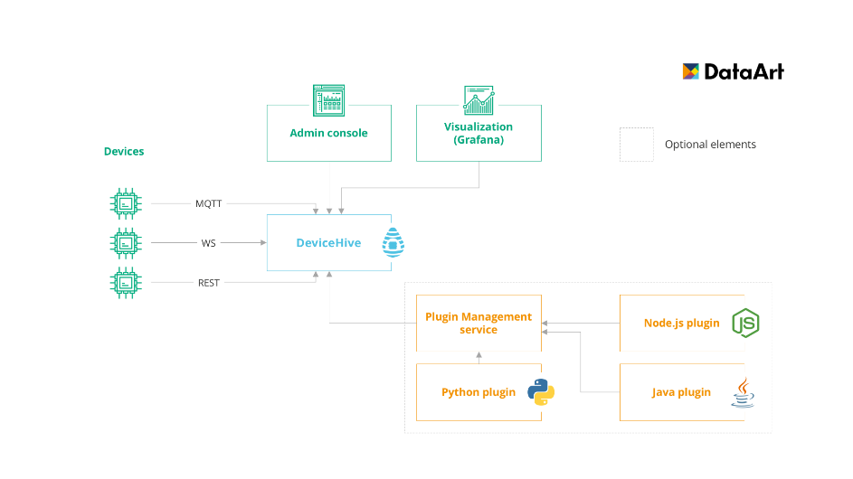

https://www.devicehive.com/

<https://github.com/devicehive>

ThingsBoard 
------------

Thingsboard.io Open-source IoT Platform

ThingsBoard是用于数据收集，处理，可视化和设备管理的开源物联网平台。它通过行业标准的物联网协议（MQTT，CoAP和HTTP）实现设备连接，并支持云和本地部署。

Thingsboard是100％开源的IoT平台，可以作为SaaS或PaaS解决方案托管它。
IT为您的物联网项目提供设备管理，数据收集，处理和可视化。
它支持提供设备连接的标准协议是MQTT，CoAP和HTTP，并支持云和本地部署。
它提供了30多个可自定义的小部件，允许您为大多数物联网用例构建最终用户自定义仪表板。

thingsboard.io开源的物联网平台主要特点：

1.  实时数据可视化和远程设备控制

2.  自定义仪表板的30个可定制小部件

3.  可定制的规则，插件，小部件和传输实现

4.  允许监视客户端和提供服务器端设备属性。

5.  支持多租户安装即装即用。

6.  支持MQTT和HTTP协议的传输加密。

7.  失败的节点可以在没有停机的情况下进行更换

<https://thingsboard.io/>

<https://github.com/thingsboard>

FogHorn
-------

FogHorn是真正的在边缘侧进行机器学习计算的物联网边缘计算软件。这句话有点绕口，但是为了强调没法子——谁让好多厂商都在吹自己有所谓的边缘计算或雾计算。

在边缘层做机器学习，而不是在云端训练好模型再远程调用训练好的机器学习模型的RESTful
API，主要原因是:

1. 节约流量

2. 响应快

3. 网络离线也可以用

4. 客户可针对单个设备微调参数

需要熟悉scikit-learn和PMML。

<https://www.foghorn.io/>

Home Assistant
--------------

Home Assistant 是一款在 Python 3
上运行的家庭自动化平台。能够跟踪和控制家庭中的所有设备，并提供自动化控制平台。

Home Assistant
有一个简单的、适合移动设备的界面来控制你的所有设备，且不会将任何数据存储在云端，以保护个人隐私。

<https://www.home-assistant.io/>

<https://demo.home-assistant.io/#/lovelace/0>

<https://home-assistant.cc/>

JetLinks 
---------

Jetlinks的定位为Paas服务的物联网平台，降低物联网企业研发、运营和运维成本，提高物联网项目的落地能力。

<https://www.jetlinks.cn/>

<https://github.com/jetlinks>

Bug Labs
--------

Bug Labs dweet和freeboard

Bug
Labs以生产模块化、基于Linux的Bug硬件装置起家，但很早以前它就演变成了与硬件无关的企业级物联网平台。

Bug Labs提供一种“dweet”消息及提醒系统和一款“freeboard”物联网设计应用软件。

dweet使用HAPI Web API和JSON，有助于发布和描述数据。

freeboard是一种拖放式工具，用于设计物联网仪表板和可视化元素。

Mainspring
----------

M2MLabs Mainspring是一个用于开发机器对机器(M2M)应用程序的应用程序框架,
例如远程控制, 车队管理或智能终端。其设施包括设备的灵活设计, 设备结构,
机器与应用程序之间的连接, 数据的验证和规范化, 长期数据存储库以及数据检索功能。

它基于Java和Apache Cassandra NoSQL数据库。
M2M应用程序可以在数小时而不是数周内建模,
然后传递到在标准J2EE服务器和高度可扩展的Apache
Cassandra数据库之上构建的高性能执行环境。

<http://buglabs.net/>

<http://www.m2mlabs.com/>

<http://www.m2mlabs.com/framework>

<https://sourceforge.net/p/m2mlabs/wiki/M2MLabs%20Wiki/>

Node-RED
--------

Node-RED是一种用于物联网的可视化工具, 即以新方式将硬件设备,
API和在线服务连接在一起。建立在Node.js之上的Node-RED将自己描述为”一种用于连接物联网的视觉手段”。

这种面向Node.js开发人员的可视化布线工具拥有基于浏览器的数据流编辑器，可用于设计物联网节点当中的数据流。然后，节点可以迅速部署成运行时环境，并使用JSON来存储和共享。端点可以在Linux开发板上运行，支持的云包括Docker、IBM
Bluemix、AWS和Azure。

Kinoma
------

Kinoma是Marvell Semiconductor的硬件原型制作平台, 涉及三个不同的开源项目。 Kimona
Create是一个用于制作电子设备原型的DIY构建套件。 Kimona Studio是可与Setup和Kinoma
Platform Runtime一起使用的开发环境。 Kimona
Connect是一款免费的iOS和Android应用程序, 可链接智能手机并将其与IoT设备连接。

PlatformIO
----------

基于Python的PlatformIO包括IDE、项目生成器和基于Web的库管理器，它是为访问来自基于微控制器的Arduino和基于ARM
Mbed的端点的数据设计的。它为200多种板卡提供了预先配置的设置，并与Eclipse、Qt
Creator及其他IDE整合起来。

IoTium
------

支持多租户，以允许多个云应用程序访问同一数据和设备。它还允许每个应用程序相互之间完全隔离，从而为WAN优化，QoS和Edge
Analytics（分析）设置自己的策略和服务。

https://www.iotium.io/

1.  硬件

    1.  FPGA

    2.  GPU

Libgdl

[一个移动端跨平台的gpu+cpu并行计算的cnn框架(A mobile-side cross-platform gpu+cpu
parallel computing CNN
framework)](https://awesomeopensource.com/project/rexbu/libGDL?categoryPage=41)

<https://github.com/rexbu/libGDL>

EduExo
------

EduExo 是一款 3D
打印的迷你外骨骼学习、开发工具包，它提供了所有外骨骼所需要的硬件，并且还附赠了安装指南。其硬件包含了电机、力传感器和
Arduino
单片机，及刚性的外骨骼接口及连接装置。它可以让使用者直接学习关于人体解刨学的知识，并且学会如何连接传感器和电子主板，设计程序控制系统。

<https://www.kickstarter.com/projects/1485976654/eduexo-the-first-robotic-exoskeleton-kit-for-stem>

Sparkfun
--------

SparkFun的边缘开发板基于最新的边缘技术，非常适合在不依赖第三方云服务的情况下完成语音甚至手势识别。

<https://www.sparkfun.com/products/15420>

<https://github.com/sparkfun/SparkFun_Edge>

<https://awesomeopensource.com/projects/sparkfun?categoryPage=41>

Arduino
-------

Arduino提供了适当的IoT硬件和软件组合,
是一个易于使用的IoT平台。它通过一系列可以提供给交互式电子设备的硬件规格进行操作。
Arduino软件包含在Arduino编程语言和集成开发环境(IDE)的计划中。

Flutter
-------

Flutter是面向电子项目的可编程处理器核心, 专为学生和工程师设计。
Flutter的荣耀在于它的长远发展。该基于Arduino开发板包括一个无线发射器,
它可以显示超过半英里的距离。另外, 你不需要路由器；颤振板可以彼此快速交互。

它由256位AES加密组成, 使用简单。其他一些功能如下。

-   快速的表现

-   富有表现力且灵活的用户界面

-   本机性能

-   现有小部件的外观和功能。

    1.  Intel

英特尔以芯片制造而闻名，作为其物联网平台的一部分，英特尔提供了一系列边缘计算产品，包括物联网网关、英特尔安全设备内置（SDO）服务，风河Helix设备云，风河Titanium边缘和具有英特尔处理器和存储功能的边缘计算组件。英特尔还拥有用于物联网部署的参考架构，开发工具包、工具和SDK，其他公司可以购买英特尔的产品来创建自己的物联网产品和服务。

英特尔网络边缘虚拟化软件开发套件（NEVSDK）旨在协助应用程序开发者利用由MEC启用的机会，提供一个综合、的参考库和API，NEV
SDK删除了需要应用程序开发人员了解复杂性和实现属性的底层移动网络协议。
https://www.intel.cn/content/www/cn/zh/communications/simplify-application-development-for-the-network-edge.html

ARM
---

ARM+Linux
的组合，占据了几乎整个智能硬件市场，而Intel仍然拿不出像样的平台来抵抗。ARM平台目前有CortexA,CortexR.CortexM,Mechine
Learning,SecurCore几个平台，其中以Cortex A系列最被市场接收。
目前，大量的智能手机（ios,android)，商业广告机，快递柜等，都是由ARM支持。由于边缘计算技术的兴起，特别是在设备侧的人脸识别，语音识别能力兴起，ARM的高阶芯片开始面向市场，可以有利地支持AI的发展。

NVIDIA
------

主打产品：芯片处理器 在智能计算芯片领域，怎么能少得了英伟达。基于Jetson
Nano处理器组装的轻型NVIDIA
EGX平台可实现每秒5亿次并把功耗维持在几瓦特；搭载NVIDIA
T4的EGX边缘服务器可以达到10万亿每秒的运算。
芯片的低功耗对人工智能运算很重要，目前传统CPU在这类运算中能耗巨大，EGX目前是少数能够实现低功耗的计算平台。Jetson
Nano处理器在最近的一项针对机器学习的基准评测中战胜了Google的EdgeTPU和英特尔的边缘处理器，取得了机器学习计算性能上的领先地位。

1.  Qualcomm

2.  Socionext

3.  NXP

4.  地平线

专注边缘人工智能芯片。2017年，地平线大规模流片并发布了边缘人工智能处理器——专注于自动驾驶的地平线“征程”系列处理器与专注于AIoT边缘计算的地平线“旭日”系列处理器。2018年，地平线托其独特的软硬结合人工智能处理器技术，相继发布了Matrix自动驾驶计算平台与和地平线XForce边缘AI计算平台。其中，地平线Matrix自动驾驶计算平台于2019年初获CES创新奖。

加速
====

在加速器选择方面，目前主要加速点包括：网络转发、DPI、Charging、IPSec、Transcoding、隧道处理、HQoS、AI、音视频编解码、视频解析、位置服务、物联网、现实增强、本地内容优化和缓存等。

1.  DPDK

2.  OFP

3.  芯片

    1.  ARM

Arm Mbed OS是Arm专门为物联网设备而设计的开源嵌入式操作系统，主要面向ARM
Cortex-M系列微控制器，非常适合涉及智能城市、智能家庭和穿戴式设备等领域的应用程序。

ARM： 发布全新的CPU品牌Neoverse（一个像ARM Cortex的新品牌）， Cloud to
Edge的基础设施， ML是主要场景之一

intel
-----

发布两款AI芯片+开源AI工具包OpenVINO： Movidius
VPU（摄像头、低功耗边缘设备）、Arria FPGA（边缘服务器）

Google TPU
----------

Google： 2018.10，发布边缘智能芯片Edge TPU

数据库
======

数据存储和高速缓存

RedisEdge
---------

<https://aijishu.com/a/1060000000089055>

PostgreSQL
----------

包括数据中心节点和中继节点。 PostgreSQL丰富的扩展能力，标准的接口，
很小的footprint是我们选择它的根本原因：

1.  可以存储时序数据；

2.  可以存储和检索json；

3.  可以用SQL；

4.  在给定的硬件条件下， 足够的快

    1.  RocksDB

RocksDB。 主要部署在边缘节点， 用于以k/v形式缓存数据， 包括上行和下行数据

网络
====

网络组网涉及垂直和水平连接。垂直网络将物和IP网络互连，而水平网络在网络信号和协议中可以异构。

垂直网络：基于IP网络的标准协议，如CoAP、XMPP、AMQP、MQTT等。

水平网络：考虑到能效或网络传输效率的各种要求。如蓝牙、ZigBee、Z-Wave等。

而网络接入形式如4G、5G、WiFi、Ethernet、IoT等接入网络；

MQTT, CoAP, ZeroMQ, AMQP, Websocket,
Kafka等物联网协议或消息中间件，这些是传输层面的，是边缘计算网关往上连接云的技术基础。

MQTT
----

MQTT
机器对机器（M2M）“物联网”连接协议。它被设计为一种非常轻量级的发布/订阅消息传递。
http://mqtt.org/

<https://github.com/mqtt>

OpenMQTT
--------

OpenMQTT
OpenMQTTGateway（MQTT网关）项目的目标是将一种不同技术集中在一个网关上，通过减少所需专有网关的数量并将不同技术的奇异性隐藏在一个简单而广泛的通信协议中来实现。

http://docs.openmqttgateway.com/

https://github.com/1technophile/OpenMQTTGateway

OpenNetworkLinux
----------------

OpenNetworkLinux 开放网络Linux
是Linux发行版，用于“裸机”交换机，即由商品组件构建的网络转发设备。开放网络Linux是开放计算项目的一部分。
http://www.opennetlinux.org/

https://github.com/opencomputeproject/OpenNetworkLinux

https://www.opencompute.org/projects

FRRouting
---------

FRRouting
FRRouting（FRR）是用于Linux和Unix平台的IP路由协议套件，其中包括BGP，IS-IS，LDP，OSPF，PIM和RIP的协议守护程序。
https://frrouting.org/\#downloads

https://github.com/FRRouting/frr

OpenAMP
-------

OpenAMP AMP系统应用软件的开源软件框架 <https://github.com/OpenAMP>

1.  TCP

2.  MR(Mixed Reality)

3.  D2D&M2M

4.  算法

    1.  Darknet

Darknet (物体识别算法)

<https://pjreddie.com/darknet/>

Wasm3
-----

用C编写的高性能WebAssembly解释器

<https://github.com/wasm3/wasm3>

[Utensor](https://awesomeopensource.com/project/uTensor/uTensor?categoryPage=41)
--------------------------------------------------------------------------------

TinyML AI推理库

uTensor是基于Mbed和Tensorflow构建的非常轻量级的机器学习推理框架。它由运行时库和脱机工具组成。uTensor生成的3层MLP的图形定义和算法实现的总大小在所得二进制文件中（不包括权重）小于32kB。

<https://github.com/uTensor/uTensor>

[uTensor的C ++代码生成器
https://utensor-cgen.readthedocs.io/en/latest/](file:///H:\EdgeComputing\uTensor的C%20++代码生成器%20https:\utensor-cgen.readthedocs.io\en\latest\)

Edgeml
------

该存储库提供了用于Microsoft Research India开发的边缘设备的机器学习算法的代码。

边缘设备的机器学习模型在存储，预测延迟和能量方面需要占用很小的空间。需要这种模型的一个实例是物联网（IoT）设置中资源稀缺的设备和传感器。在不连接到云的情况下在IoT设备上本地进行实时预测所需的模型需要几千字节的大小。

<https://github.com/microsoft/EdgeML>

Photolabeller
-------------

Federated Learning: Client application doing classification of images and local
training.

https://github.com/mccorby/PhotoLabellerServer

<https://github.com/mccorby/PhotoLabeller>

1.  仿真

    1.  iFogSim

iFogSim
雾计算，边缘计算和IoT的高性能开源工具包，用于建模和模拟边缘计算，物联网和雾计算的网络。
<https://github.com/Cloudslab/iFogSim>

Libxsmm
-------

针对英特尔架构的库，用于专门的密集和稀疏矩阵运算以及深度学习原语。

LIBXSMM是一个用于专用密集和稀疏矩阵运算以及深度学习原语（例如小卷积）的库。该库的目标是采用英特尔SSE，英特尔AVX，英特尔AVX2，英特尔AVX‑512（带有VNNI和Bfloat16）的英特尔架构。代码生成主要基于即时（JIT）代码专业化，以实现与编译器无关的性能（矩阵乘法，矩阵转置/复制，稀疏功能和深度学习）。LIBXSMM适用于“一次构建并在任何地方部署”，即，不需要特殊的目标标志来利用可用的性能。支持GEMM数据类型有：FP64，FP32，bfloat16，int16，和int8。

<https://github.com/hfp/libxsmm/wiki/Q&A>

<https://github.com/hfp/libxsmm>

CloudSim
--------

CloudSim
云计算建模和仿真框架的基础架构和服务，其他扩展插件包括Cloud2Sim、WorkflowSim、DynamicCloudSim、RealCloudSim、CloudReports、CloudAuction、FederatedCloudSim等

<https://github.com/Cloudslab/cloudsim>

EmuFog
------

EmuFog 大型雾计算可扩展和可扩展仿真基础架构

<https://github.com/emufog/emufog>

FogTorch
--------

FogTorch 物联网应用的QoS感知部署的工具

<https://github.com/di-unipi-socc/FogTorch>

cloonix
-------

网络模拟平台，可以用图形化的方式构造网络拓扑，可以设置链路的延迟和丢包率

<https://github.com/clownix/cloonix>

imunes
------

imunes 集成的多协议网络模拟器/仿真器

<https://github.com/imunes/imunes>

contiki
-------

contiki 专门针对物联网或者无线传感器网络应用的操作系统和协议栈，类似的系统TinyOS

<https://github.com/contiki-os/contiki>

Cooja
-----

Cooja cooja是contiki网络模拟器。cooja允许对contiki motes的网络进行模拟

<https://github.com/contiki-ng/cooja>

CupCarbon
---------

CupCarbon 智能城市和物联网无线传感器网络（SCI-WSN）模拟器

<https://github.com/bounceur/CupCarbon>

<http://www.cupcarbon.com/>

DSA
---

DSA 物联网设备，服务和应用程序的开源物联网平台和“工具包”

<http://iot-dsa.org/>

<https://github.com/IOT-DSA/docs/wiki>

Mininet
-------

Mininet
由一些虚拟的终端节点（end-hosts）、交换机、路由器连接而成的一个网络仿真器，采用轻量级的虚拟化技术设计。<https://github.com/mininet>

Netkit
------

Netkit
基于Linux的开源网络模拟器，netkit-ng是netkit的分支，为最新的debian内核和文件系统带来支持<http://netkit-ng.github.io/>

Unetlab
-------

Unetlab
以ubuntu为基础设计的一个超强网络实验模拟器，iou-web的升级版。商用版本EVE-NG（全称Emulated
Virtual Environment - NextGeneration）

<http://www.routereflector.com/unetlab/>

<https://github.com/dainok/unetlab>

<http://www.eve-ng.com/>

Shadow
------

Shadow
独特的离散事件网络模拟器，模拟运行真实的应用程序，比如Tor，以及在一台机器上由数千个节点组成的分布式系统。

<https://shadow.github.io/>

<https://github.com/shadow/shadow>

GNS3
----

GNS3 网络软件模拟器。 它允许组合的虚拟和实际设备，用于模拟复杂的网络。
https://gns3.com/

<https://sourceforge.net/projects/gns-3/>

NS3
---

NS3 一系列离散事件网络模拟器，包括ns-1、ns-2和ns-3 https://www.nsnam.org

<https://github.com/nsnam>

CORE
----

Common Open Research
Emulator（CORE）是一种用于在一台或多台计算机上仿真网络的工具。<https://www.nrl.navy.mil/itd/ncs/products/core>

<https://github.com/coreemu/core>

<https://www.nrl.navy.mil/itd/ncs/projects>

OMNeT
-----

<https://omnetpp.org/>

OMNeT++是一个离散事件模拟器，一般用来进行网络仿真。

Veins
-----

Veins (车联网模拟器)

<http://veins.car2x.org/>

SUMO
----

SUMO (车流量模拟器)

<https://sumo.dlr.de/docs/>

Mavros 
-------

Mavros (无人机通信模拟器)

<https://github.com/mavlink/mavros>

Icarus 
-------

Icarus (信息中心网络模拟器)

<https://icarus-sim.github.io/>

# SDR

## 3GPP架构组件

<https://www.sdnlab.com/16444.html>

<http://thenewstack.io/opensource-virtual-network-functions-part3/>

| **No.** | **EPC Functionality with Increasing complexity  (from 3GPP ref Architecture)** | **Components (Additional)**                                                   |
|---------|--------------------------------------------------------------------------------|-------------------------------------------------------------------------------|
| **1 **  | Minimal EPC – LTE accesses only, no PCC (Policy and Charging control)          | MME, PDN-GW, S-GW, E-UTRAN, HSS (home subscriber server), EIR, (Optional IMS) |
| **2**   | \+ PCC  for LTE accesses only                                                  | PCEF, BBERF, PCRF, OCS, OFCS, SPR, AF.                                        |
| **3**   | \+ The legacy GPRS Packet Core  and its 2G/3G accesses (co-existence)          | 1. GERAN, CS_MGW, MSCS – PSTN.2. UTRAN, SGSN, GGSN – PDNs                     |
| **4**   | \+ GERAN and UTRAN accesses via legacy SGSN and Gn (during transition to EPC)  | (No additional components)                                                    |
| **5**   | \+ 2G/3G accesses via evolved SGSN and S4 (target EPC, for 2G/3G/4G accesses)  | S4-SGSN.                                                                      |
| **6**   | \+ Direct user path via S12, and control via S4 for UTRAN only                 | (No additional components.)                                                   |
| **7**   | \+ Voice services:  CS FallBack (CSFB) via SGs and SRVCC via IMS and Sv        | SCCAS                                                                         |
| **8**   | \+ Trusted non-3GPP accesses via S2a                                           | 3GPP-AAA-Proxy/Server                                                         |
| **9**   | \+ Untrusted non-3GPP accesses via S2b                                         | ePDG                                                                          |
| **10**  | \+ Access Network Discovery Support Functions via S14                          | ANDSF                                                                         |

IP多媒体子系统（IMS）是一个用于提供IP多媒体服务的体系结构框架。

|                   **IMS Functionalities**                    | Components                    |
| :----------------------------------------------------------: | ----------------------------- |
|                       **PSTN gateway**                       | BGCF, IMS-MGW, MGCF           |
|                       **User-Profile**                       | HSS, SLF                      |
|            **IMS-Core (Call session management)**            | S-CSCF, I-CSCF, P-CSCF, ECSCF |
|                    **Application Server**                    | TAS, SCCAS, AS                |
|               **Multimedia Resource Function**               | MRFP, MRFC                    |
|                      **Border Control**                      | IBCF, TrGW                    |
| **Others (Media Resource Broker, Location Retrieval and Emergency access transfer)** | MRB, LRF, EATF                |

当前存在有相当数量的开源项目来实现EPC架构的各个组件。下表中列出了一些软件。然而，需要理解的是，不存在单一的软件解决方案可以实现完整的EPC。为了实现这一目标，不同的软件必须合作而且所谓的“胶”被发明出来从而使得这些软件可以共同实现EPC的功能。

| **EPC/IMS Component**         | **Open source Software**                     |
|-------------------------------|----------------------------------------------|
| **HSS**                       | OpenIMSCore, OpenHSS, Clearwater IMS         |
| **P-GW**                      | nwEPC                                        |
| **S-GW**                      | nwEPC                                        |
| **IMS Core**                  | OpenIMS core, Clearwater IMS,                |
| **PCRF**                      | FreePCRF                                     |
| **PCEF**                      | OpenIMS                                      |
| **BBERF**                     | –NA–                                         |
| **CDF**                       | OpenCDF                                      |
| **CGF**                       | Open-CGF                                     |
| **ePDG**                      | –NA–                                         |
| **AAA**                       | OpenDPS,  OpenBloX                           |
| **MME**                       | OpenAirInerface                              |
| **ANDSF**                     | Libdmclient , Funambol  DM Server and Client |
| **eNB**                       | Openairinterface                             |
| **UE**                        | Openairinterface                             |
| **Network Management**        | OpenNMS                                      |
| **Service Availability**      | OpenSAF                                      |
| ** SS7, SIGTRAN, MGCP, VoIP** | OpenSS7                                      |
| **BI**                        | Pentaho                                      |
| **ERP+CRM**                   | OpenTaps                                     |
| **Enterprise Automation**     | Ofbiz                                        |
| **Decision Support System**   | OpenCDS                                      |
| **Billing**                   | jBilling                                     |
| **Service Accounting**        | OpenPortal                                   |

虚拟交换和路由

两个最重要的网络功能是路由和交换功能。NF的目标是通过运行于商业硬件或虚拟机上来支持各种标准协议，例如BGP
＆ OSPF。下面，我们将介绍一些用于实现交换和路由功能流行的开源软件。

交换：

Linux网桥：这是一种通过IEEE
802.1D协议基于软件的交换机，自带的Linux发行版作为内核模块。它包括FDB （转发DB）
， STP（生成树） ，混杂模式以接收所有数据包过滤和流量整形支持 -
这使得它比通过硬件实现的网桥功能更强大。

OpenVswitch（ OVS
）：OVS可能是目前最流行和广泛使用基于软件的交换机。它支持OpenFlow，并且可作为一个通用的交换机。它包括各种功能，例如asVLAN标记，
VXLAN ，GRE ，粘接（bonding），基于流的转发(flow based
forwarding)，用户空间的控制台(user space control plane)等。

Lagopus：这是另外一种兼容OpenFlow 1.3的软件交换机。类似OVS 一般，它也与Intel
DPDK非常匹配。，他们在他们的路线图中计划集成其他控制台方案，如Quagga和GoBGP
，对此我相信会非常有利于开放的各种用户解决方案。

Vale/Netmap：类似于Linux网桥和OVS，Vale连接了物理或虚拟网络接口。然而，较之其他软件的交换机，它拥有更高性能（高吞吐量和低CPU使用率）和可扩展性。更好的性能是通过Netmap的API来实现的，事实上，Vale
是作为Netmap分发（distribution）的一部分提供的。

路由：

Quagga：Quagga是个拥有许多小型后台进程的集合，每一个后台进程都有一个特定的任务。这个任务可能是运行一个OSPF或BGP等路由协议。Zebra后台进程负责与内核进行交互，并提供了一个简单的API
（称为Zserv
）供其他后台进程使用，所以它们并不需要直接调用内核。其他的后台进程运行各自的协议。用户可以配置Quagga，使所有这些后台进程从同一个位置查看它们的配置文件，或者单独配置每个后台进程。

BIRD：BIRD是一个由布拉格查理大学数学和物理学院教授们开发的项目。目前，它由CZ.NIC实验室开发和支持。BIRD项目旨在开发一个功能齐全的动态IP路由程序，主要是针对于（但不限于）Linux
， FreeBSD和其他类UNIX系统和GNU通用公共许可证下发布的系统。它同时支持 IPv4和IPv6
（需要使用-enable - IPv6来进行配置）的， 多种路由表BGP ，RIP，OSPF
，静态路由及IPv6路由器公告等。

VYoS：VyOS是一款基于Linux的网络操作系统，它提供基于软件的路由功能，包括各种OSPF，BGP路由协议，集成了防火墙和VPN的支持功能。
VyOS其实是Vyatta（被博科通讯Brocade Communications收购）的一个分支。

虚拟商网元（个人网络设备）

研究人员认为，虽然核心路由器的虚拟化是不可行的，但是至少在不久的将来，由于高性能（吞吐量）的需求，骨干网边缘（PE）路由器的虚拟化将是一个更可行的选择。

虚拟专用网络的服务，如L3 VPN的IP （每个PE设备的作用就像一组虚拟路由器） ，L2
VPN，
EVPN和伪线（pseudowires）在被当虚拟化时，这些功能会体现出灵活性和可扩展性，这将是对供应商的一个主要收益之处，许多供应商已经考虑通过执行在云中执行相同的虚拟化来实现例如PE的功能。

与PE路由器相类似，宽带远程接入服务器（B -RAS
）是供应商网络将各种互联网流量来源，如DSL
，有线网络，无线宽带网络和以太网等，而汇聚于一个单一由从DSLAM设备出入的网络。它可以是一个简单的路由器从核心到客户端转发数据包（反之亦然），或一个复杂的路由器（通过每个用户）实现IP政策，Qos，包处理（packet
manipulation），限制器等虚拟化功能. BRAS的虚拟化功能也被证明
无论是在成本和灵活性/可扩展性方面 都有益于 用于网络服务供应商。

开源个人网络设备

之前提到的大多数路由类开源软件如路由，如Quagga，VyOS和BIRD，都可以用来实现众多PE的功能。这些例如IPtables(netfilter)和Radius-server(freeRADIUS)
之类的软件都属于标准Linux发行版的一部分，可分别用于虚拟防火墙和虚拟AAA
。软件snort在一些NFV应用部署中被用于虚拟入侵检测系统（virtual IDS）。

此外，其他的软件如MPLS-Linux和xl2tp-daemon也可用于虚拟化的PE的功能。最近，AT＆T和爱立信共同通过OpenDaylight控制器提出了基于SDN的L3VPN
。

虚拟CPE

客户端设备或CPE是指那些通常位于企业或住宅宽带用户端的网络终端设备，用于与电信服务运营商网络对接服务。通常情况下，服务运营商可以通过从不同的硬件厂商，企业用户和住宅用户来配置和管理客户端设备。

如果不使用虚拟化的CPE，每当任何新技术的应用，增加新的服务，或对安全性，保密性和计量功能的升级都可能会显著增加服务运营商的成本。

通过虚拟的CPE，大多数的CPE功能被拉出客户端并移入运营商的网络（可能是在其数据中心）
。这样产生了一个“简化”的CPE
，CPE充当了连接到服务运营商网络的简单Layer-2转发设备。通常情况下，如DHCP
，防火墙，NAT，路由，VPN等服务通过在运营商的数据中心作为一个虚拟机（
VM）实例中运行的虚拟网络功能（ VNFs ）提供。

开源vCPE ：

网络服务，如DHCP ，防火墙，NAT， DNS（ vDHCP ， VFW ， vNAT ， VDNS ， ）
，都可以通过开源实现，并且可以作为许多标准的Linux发行版的一部分发行。例如，
DNS和DHCP可以用dnsmasq来部署。而用于实现NAT和防火墙的IPtables，一直没有有针对于NFV
和致力于构建虚拟客户端设备的独立的开源项目，例如客户路由器，虚拟机顶盒和虚拟的家庭路由器。

虚拟访问网元

驻留在混合光纤的DSL “远程”节点，例如FTTcab和FTTdp
，通常位于街道或建筑物接入网络的功能，正逐渐成为虚拟化的热点。出于经济上的考量，这些节点应尽量紧凑，具有非常低的功率消耗和非常低的维护成本。对这些远程节点的简化可以通过对某些功能如
OLT ， DSLAM ，ONU， ONT ，
MDU和DPU等的虚拟化，把复杂的工作转移到虚拟化环境来达到经济上的可行性。

OAI
---

OAI是由欧洲的Eurocom组织开发并维护的开源SDR LTE平台，是目前最为完善的开源SDR
LTE平台。

1. 主要特征

\- 开源项目

\- 按照3GPP协议同时实现了EPC，eNB和UE

\- 项目持续更新，目前已经支持Release 10

\- 支持支持FDD/TDD，1.4, 3, 5, 10, 15 和 20 MHz 带宽 （目前5 MHz 和10 MHz
带宽运行比较稳定）

\- 项目包含仿真平台和SDR
硬件实现平台。仿真平台包含链路级仿真平台，如dlsim，系统级仿真平台，如oaisim。

\- 项目支持多种硬件设备，如USRP，bladeRF和EXMIMO等

\- 目前eNB代码较稳定，UE侧代码不太稳定

2. 应用场景

\- 各种链路级仿真，系统级仿真

\- OAI eNB + OAI UE without S1

\- OAI EPC + OAI eNB + OAI UE

\- Third-party EPC + OAI eNB + OAI UE

\- OAI EPC + OAI eNB + 商用终端（COST UE）

\- Third-party EPC + OAI eNB + 商用终端（COST UE）

3. 相关链接

\- 官方网站 http://www.openairinterface.org/

\- 项目教程 https://twiki.eurecom.fr/twiki/bin/view/OpenAirInterface/WebHome

\- 代码获取 https://gitlab.eurecom.fr/oai/openairinterface5g

srsLTE 
-------

srsLTE是由SoftwareRadioSystems 实现的开源软件，起初只实现了LTE下行物理层链路功能

1. 主要特征

\- 开源项目

\- 按照3GPP协议实现了eNB侧物理层下行的功能

\- 目前只支持Release 8

\- 只支持FDD SISO模式, 1.4, 3, 5, 10, 15 和 20 MHz 带宽

\- 项目支持USRP, bladeRF等硬件

\- 产品稳定，代码优化较好，可以用作SDR开发的库

2. 应用场景

\- srs eNB + srs UE （物理层下行链路）

3. 相关链接

\- 官方网站 http://www.softwareradiosystems.com/

\- 代码获取 https://github.com/srsLTE/srsUE 和 http://github.com/srsLTE/srsLT

srsENB 
-------

SoftwareRadioSystems
公司开源了其全协议栈的srsENB平台，参考平台测试srsENB+srsUE+Amarisoft MME[4]

1. 主要特征

\- 开源项目

\- 完全按照3GPP协议实现了全协议栈UE(srsUE)和全协议栈的eNB(srsENB)

\- 目前只支持Release 8

\- 只支持FDD TM1和TM2传输模式, 1.4, 3, 5, 10, 15 和 20 MHz 带宽

\- 项目支持USRP, bladeRF等硬件

\- 产品稳定，代码优化较好，可以用作SDR开发的库

2. 应用场景

\- Third-party MME+ srsENB + srs UE

\- Third-party MME+ Third-party ENB + srs UE

\- Third-party MME+ srsENB + Third-party UE

\- Third-party MME+ srsENB + 商用终端（手机、LTE数据卡）

3. 相关链接

\- 官方网站 http://www.softwareradiosystems.com/

\- 代码获取 https://github.com/srsLTE/srsUE 和 http://github.com/srsLTE/srsLTE

OpenLTE 
--------

OpenLTE由之前摩托罗拉的一位工程师发起的开源项目。

1. 主要特征

\- 项目开源

\- 项目只包含EPC和eNB，而且只包含FDD模式

\- 只能传输信令，不能传输业务

2. 应用场景

\- OpenLTE EPC + OpenLTE eNB等

3. 相关链接

\- 代码获取1 http://openlte.sourceforge.net/

\- 代码获取2 https://sourceforge.net/projects/openlte/

Amarisoft 
----------

Amarisoft是由Fabrice Bellard等实现的商业软件，是目前性能最好的SDR LTE平台。

1. 主要特征

\- 项目不开源

\- 完全按照协议实现3GPP LTE协议的 eNB, EPC和UE

\- eNB支持LTE Release 13, UE支持LTE Release 12

\- 支持FDD/TDD, 1.4, 3, 5, 10, 15 和 20 MHz 带宽

\- 项目留有硬件接口，对硬件没有要求（支持各种不同的硬件）

\- 软件优化较好，产品能在笔记本上运行

\- Amari UE 100 能在一台电脑上模拟并发送500个UE的数据

\- 最近项目还在eNB侧添加了对NB-IoT协议的支持

2. 应用场景

\- 项目不开源，应用场景受软件授权的限制。

3. 相关链接

\- 官方网站 <http://www.amarisoft.com/>

OSLD
----

Open-Source Long-Term Evolution (LTE) Deployment (OSLD) 1. 主要特征

\- 支持包括提供“用于构建基站和移动终端的模块化，提供开源LTE库

\- ALOE（抽象层和开放操作环境），提供了用于开发开源LTE系统的DSP框架

\- FlexNets灵活的无线通信系统和网络

\- Xenomai提供Linux上具有硬实时功能，并且包括一些针对MATLAB和GNU
Octave的通道模型

2. 应用场景

\-
为移动终端和基站开发模块化的LTE库，并提高ALOE的可访问性，以低成本构建复杂的无线电系统。

3. 相关链接

\- 官方网站 https://sites.google.com/site/osldproject/

\- 方网站 htps://nlnet.nl/project/osld/

\- https://github.com/agelonch/aloe

GnuRadio 
---------

1. 主要特征

\- GNU
Radio是一个免费的软件开发工具包，提供信号处理模块以实现软件定义的无线电和信号处理系统。

\- GNU
Radio模块：gr-lte、gr-lpwan、gr-dab、gr-fbmc、gr-gfdm、gr-radar、gr-specest、gr-cbmc、gr-drm、gr-classifier、gr_channelsounder。

\-
gr-lte是一个GNURadio模块，gr-lte专注于构建LTE接收器-特别是LTE信号的接收，同步和解码。

2. 应用场景

\- 以与外部RF硬件一起使用，以创建软件定义的无线电，如GnuRadio + OpenLTE +
SDR搭建4G LTE基站。

\- 在类似仿真的环境中无需硬件。

3. 相关链接

\-代码获取1 https://github.com/kit-cel/

\-代码获取2 https://github.com/gbaier/gr_channelsounder

\-介绍 https://en.wikipedia.org/wiki/GNU_Radio

该项目是在德国卡尔斯鲁厄技术学院（KIT）的通信工程实验室（CEL）发起，网址为http://www.cel.kit.edu。

\- FlexNets http://flexnets.upc.edu；http://flexnets.upc.edu/trac/

\- GNU Radio http://gnuradio.org

\- OSSIE from Wireless\@VT (http://ossie.wireless.vt.edu/)

\- libLTE https://github.com/agelonch/libLTE

\- <https://xenomai.org/>

1.  CRAN

2.  O-RAN

O-RAN（开放无线接入网）
O-RAN开源社区将基于O-RAN联盟制定的相关规范和接口标准，C-RAN联盟和xRAN论坛合并之后的产物。

1. 主要特征

\- 接口开放化

实现原有封闭接口的开放，降低区域性单一厂商的依赖性，鼓励创新，降低成本。

\- 软件开源化

推动无线协议栈开源，共享代码，降低研发成本，让产业企业把更多精力聚焦在核心算法和差异化功能软件的研发上。

\- 硬件白盒化

将传统BBU硬件用通用COTS服务器代替。而RRU部分，引入软件定义无线电技术和通用硬件，进行代替。

\- 网络智能化

RAN开放和解耦之后，可以引入大数据、人工智能等方法，实现复杂组网环境下的高效运维管理，提升频谱资源的利用率，降低网络能耗。

2. 应用场景

\-
推动RAN接口开放化、硬件白盒化、软件开源化、网络智能化，以此打破传统封闭的RAN构架，从而降低RAN部署成本，提升RAN敏捷性和加速创新。

3. 相关链接

\- 官方网站：https://www.o-ran.org/

\- http://wiki.oran-osc.org/display/ORAN

\- https://gerrit.o-ran-sc.org/r/q/status:open

OMEC 
-----

1. 主要特征

\- OMEC包括以下EPC和计费组件：

SGW-C，PGW-C（包括嵌入式PCEF），SGW-U，PGW-U，MME，HSS，HSS数据库，路由功能，PCRF，转发策略控制SDN控制器，CTF，CDF，SGX计费路由器

\- CLI，日志记录和VNF的统计接口API

\- 基于DPDK的流量生成器，用于测试S1u和Sgi用户平面

\- 部署自动化，用于启动核心网络VNF，关联的网络，程序包安装，设置，x和配置

2. 应用场景

\- OMEC是第一个功能齐全，可扩展的高性能开源EPC。

3. 相关链接

\-
官方网站：https://www.opennetworking.org/omec/?utm_referrer=https://www.section.io/blog/telco-cooperation-accelerates-5g-edge-computing/

\- 源码地址：https://github.com/omec-project

1.  OS

    1.  Linux

    2.  Nanos

Nanos是一种新内核，旨在在虚拟化环境中运行一个和一个应用程序。与诸如Windows或Linux的通用操作系统相比，它具有几个约束条件-即它是一个单进程系统，不支持运行多个程序，也没有用户概念或通过ssh进行远程管理。

<https://github.com/nanovms/nanos>

ops - build and run nanos unikernels

[https://ops.city](https://ops.city/)

<https://github.com/nanovms/ops>

Firecracker
-----------

<https://github.com/firecracker-microvm/firecracker>

Deviceplane
-----------

嵌入式系统和边缘计算的开源设备管理。

Deviceplane是用于嵌入式系统和边缘计算的开源设备管理工具。它有助于解决与远程设备管理有关的各种基础结构问题，例如：

1.  网络连接和SSH访问

2.  编排和部署远程更新

3.  主机和应用程序监控

4.  设备组织：设备的命名，标记，搜索和过滤

5.  访问和安全控制

Deviceplane通过系统管理员运行轻量级静态二进制文件来与您的设备集成。

<https://deviceplane.com/>

<https://github.com/deviceplane/deviceplane>

Haiway
------

Haiway是基于实时优先级的微内核RTOS，具有对ARMv8-A的虚拟化支持，为边缘计算提供了可信赖的可靠性和性能，同时还允许多个操作系统安全地共存于同一片上系统（SoC）。

<https://github.com/leeeastwood/Haiway>

1.  虚拟化

    1.  Kata

<https://katacontainers.io/>

<https://github.com/kata-containers>

IO Visor
--------

IO
Visor开发和共享虚拟化内核IO服务的功能，以实现跟踪，分析，监视，安全和网络功能。

https://www.iovisor.org

https://github.com/iovisor

1.  Docker

2.  Hypervisor

3.  SRIOV

4.  KVM

5.  安全

    1.  Ockam

构建您可以信任的连接系统的工具。

[https://www.ockam.io](https://www.ockam.io/)

<https://github.com/ockam-network/ockam>

1.  应用开发

    1.  AoE

AoE (AI on Edge) 是一个开源的 终端侧 AI 集成运行时环境 ( IRE
)。帮助开发者将不同框架的深度学习算法轻松部署到终端高效执行。

https://didi.github.io/AoE

https://github.com/didi/AoE

Macchina.io
-----------

Macchina.io
提供了一种“支持Web、模块化、可扩展的”JavaScript和C++运行时环境，可用于开发在Linux开发板上运行的物联网网关应用程序。

macchina.io边缘设备SDK是功能强大的IoT设备应用软件平台。

macchina.io在Linux之上提供了一个支持Web的，安全的，模块化的和可扩展的C
++和JavaScript IoT应用程序环境，其中包括中间件，协议和丰富的API。

macchina.io提供了易于使用且经过行业验证的软件构建块，使应用程序可以在本地，直接在其来源以及发生动作的地方收集，处理，过滤，分析和可视化传感器，机器和过程数据。macchina.io支持物联网边缘和雾计算。

macchina.io可在基于Linux的设备上运行，包括IoT网关，工业计算设备以及Raspberry
Pi，Beaglebone和MangOH等原型平台。

<https://macchina.io>

<https://github.com/macchina-io/macchina.io>

Kinetic Edge
------------

边缘计算平台，它为云提供商，网络规模的公司和其他企业提供了最佳的方式来大规模交付边缘应用程序，而无需构建自己的数据中心或打乱自己的光纤

<https://www.vapor.io/>

OPENi 基于Web的开放源代码，应用程序与Cloudlet云的服务的集成框架

<https://tssg.org/projects/openi/>

OpenAPI
=======

<https://github.com/OAI>

<https://www.openapis.org/>

GitHub
上接口规范文档：<https://github.com/OAI/OpenAPI-Specification/blob/master/versions/3.0.0.md#responseObject>

较易理解的接口规范文档：<https://www.breakyizhan.com/swagger/2810.html>

如何编写基于OpenAPI规范的API文档：<https://legacy.gitbook.com/book/huangwenchao/swagger/details>

非常好用的OpenAPI文档编写工具SWAGGERhub,在线编辑，自动mock：<https://app.swaggerhub.com>

下载OpenAPI 3 / Swagger API 模拟服务器：<http://stoplight.io/platform/prism/>

1.  自动驾驶

2.  无人机

3.  游戏

4.  AI

AI 与边缘计算结合的双向优化

合理利用算力协同，也能够做到在边缘侧进行训练。目前工业界还没有成熟的模式，但学术界有相关的研究。如下图所示的ICE智能协同计算框架，将边缘AI的训练分为三个阶段：

第一阶段为预训练阶段（pre-train），云上的应用可以通过读取云端存储的公共数据，来训练一个通用的模型，这是边缘AI的底座，如果没有云端强大算力的帮助，只靠边缘侧算力是难以得到比云端训练更优秀的AI模型。

第二阶段将通用模型下发至边缘侧，读取边缘私有数据，通过转移学习（Transfer
Learning），来得到边缘模型。

第三阶段读取增量数据，利用增量学习（Incremental
Learning）生成最终边缘模型，这个最终边缘模型就可以用于用户侧的推理了。

这种三步学习的算力协同的模式，可以更好地满足边缘智能的个性化服务需求。

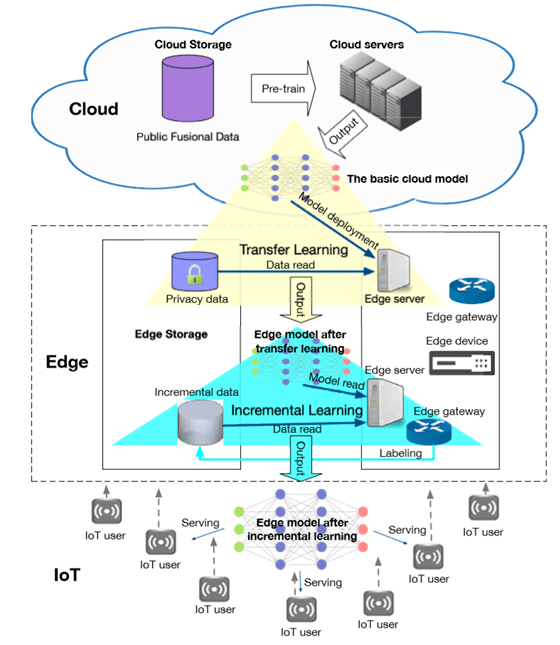

目前业界针对边缘计算场景，也提出了针对性的设计方案，例如用于移动设备或嵌入式设备的轻量级解决方案TensorFlow
Lite，Caffe2和Pytorch等。

此外，边缘计算在AI训练提速、安全信息预处理、边云一体的AI算法上仍处于起步阶段。设计面向轻量级、高效和可扩展的边缘计算AI框架是实现边缘智能，极大拓展更多边缘AI场景落地的重要步骤。

TensorFlow Lite
---------------

TensorFlow Lite 提供了转换 TensorFlow
模型，并在移动端（mobile）、嵌入式（embeded）和物联网（IoT）设备上运行TensorFlow
模型所需的所有工具。

特点：

1.  只含推理（inference）功能，使用的模型文件需要通过离线的方式训练得到。

2.  最终生成的模型文件较小，均小于500kB。

3.  为了提升执行速度，都使用了ARM NEON指令进行加速。

4.  支持跨平台，包括Linux、Android和iOs。

    1.  Caffe2

Caffe2 是一个兼具表现力、速度和模块性的深度学习框架，是 Caffe
的实验性重构，能以更灵活的方式组织计算。Caffe2可帮助开发人员和研究人员
训练大规模机器学习模型，并在移动应用中提供 AI
驱动的用户体验。现在，开发人员可以获取许多相同的工具，能够在大规模分布式场景训练模型，并为移动设备创建机器学习应用。

特点：

1.  可以在iOS系统、Android系统和树莓派（Raspberry Pi）上训练和部署模型；

2.  使用比较简单，只需要运行几行代码即可调用Caffe2中预先训练好的Model Zoo模型；

3.  NVIDIA（英伟达），Qualcomm（高通），Intel（英特尔），Amazon（亚马逊）和Microsoft（微软）等公司的云平台都已支持Caffe2；

    1.  PyTorch

PyTorch 是最新的深度学习框架之一，由 Facebook 的团队开发，并于 2017 年在 GitHub
上开源。PyTorch
很简洁、易于使用、支持动态计算图而且内存使用很高效，因此越来越受欢迎。

特点：

1.  改进现有的神经网络，提供了更快速的方法——不需要从头重新构建整个网络，这是由于
    PyTorch 采用了动态计算图（dynamic computational
    graph）结构，而不是大多数开源框架（TensorFlow、Caffe、CNTK、Theano
    等）采用的静态计算图；

2.  强大的社区支持，facebook的FAIR强力支持，FAIR是全球TOP3的AI研究机构。PyTorch论坛，文档，tutorial，一应俱全。FAIR的几位工程师更是全职维护开发，github上PyTorch每天都有许多pull
    request和讨论。

P2P
===

P2P流媒体

<https://blog.csdn.net/qq_29842085/article/details/79698980>

P2P Networking Theory(http://cis.poly.edu/\~ross/p2pTheory/)： P2P
Networking理论
